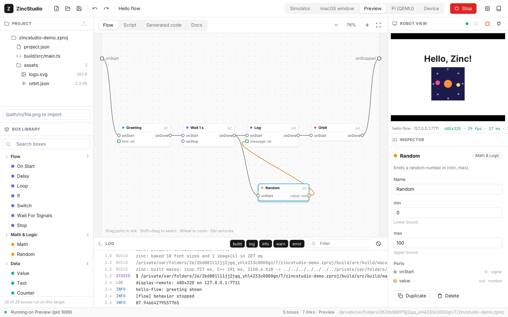

# ZincStudio

A node-based editor for Zinc apps, in the spirit of Aldebaran's Choregraphe — and itself a Zinc app (macOS, SDL3
window, zinc:ui Solid model). Build a behavior by linking boxes, read the Zinc program it generates, run it in the
simulator, in a window, live inside the studio, or deploy it to a Raspberry Pi.



```sh
node compiler/bin/zinc.mjs run apps/studio                                 # last project, or the hello-flow sample
node compiler/bin/zinc.mjs run apps/studio -- path/to/app.zproj            # open a project
apps/studio/src/build/macos/cmake/app --generate path/to/app.zproj         # headless: write build/src/main.ts
sh apps/studio/test.sh                                                     # headless checks (see below)
```

Start it with `zinc run` / `zinc dev` from any directory (they pass `ZINC_HOME`; set it yourself for an exported app): the studio drives `compiler/bin/zinc.mjs` and reads the docs
there. Recent projects and ssh devices are kept with `zinc:storage`, in `./zinc.storage` unless `ZINC_STORAGE` points
elsewhere (`ZINC_STORAGE=~/.zincstudio`). User guide: [docs/studio.md](../../docs/studio.md).

## Features

| Panel | What |
| --- | --- |
| Toolbar | New / Open / Save, undo / redo, the run target (Simulator, macOS window, Preview, Pi (QEMU), Device), Run / Stop, Devices, Docs |
| Project | `project.json`, `build/src/main.ts`, the assets with kind and size; import a file by path (copied into `assets/`) |
| Box library | 30 built-in boxes in 8 categories, search, collapsible tree; boxes that need a plugin missing on the target are greyed (`zinc plugins`) |
| Flow diagram | pan / zoom canvas, drag boxes in from the library, move, link output → input with bezier curves (typed ports), rectangle and shift selection, duplicate, delete, start / end bars like Choregraphe |
| Script / Generated code | a Script box's own code in the code editor; the expanded template of any other box; the whole generated program, read only |
| Docs | a `zinc:webview` page (Markdown rendered in the page) that calls the studio: `listDocs`, `readDoc`, `openExample` |
| Log | build output and the app's console with levels (JSON log lines), level toggles, text filter, auto-scroll |
| Robot view | the running app's screen through `zinc:remote` (display `remote`), pointer and keys forwarded, fps / latency / bandwidth |
| Inspector | box name, parameters with validation (numbers, ranges, toggles, choices, asset pickers), ports; link; several boxes; asset preview (SVG, PNG, Lottie, video); project settings |
| Devices | apps announcing a remote display on the LAN (click to view), ssh devices (`user@host`) for deploys |

Shortcuts: Cmd+S save, Cmd+Z / Shift+Cmd+Z undo / redo, Cmd+D duplicate, Delete remove, Cmd+R run, Cmd+. stop,
Cmd+O open, Cmd+N new, Escape deselect / close a dialog.

## Architecture

```mermaid
flowchart LR
  subgraph data [plain data]
    library[library.ts<br/>box definitions + code templates]
    project[project.ts<br/>project.json format, paths]
    codegen[codegen.ts<br/>diagram → Zinc TS]
  end
  subgraph state [reactive state]
    model[model.ts<br/>boxes, links, selection, undo]
    runner[runner.ts<br/>zinc CLI via zinc:process, log]
    devices[devices.ts<br/>zinc:remote session + discovery, ssh list]
    assets[assets.ts<br/>files, import, previews]
    docs[docs.ts<br/>zinc:webview bridge]
  end
  subgraph ui [ui/*.tsx]
    app[app.tsx layout, shortcuts]
    graph[graph.tsx flow editor]
    panels[panels / inspector / editors / logs / robot / dialogs]
    kit[kit.tsx buttons, tabs, icons]
  end
  cli[cli.ts --generate] --> codegen
  model --> project
  model --> library
  codegen --> library
  runner --> codegen
  runner -->|zinc build / run / deploy| zinc[(compiler/bin/zinc.mjs)]
  runner -->|spawn app, ZINC_LOG_FORMAT=json| appproc[generated app]
  appproc -->|display remote :7711| devices
  ui --> model
  ui --> runner
  ui --> devices
  ui --> assets
  ui --> docs
```

- **Project** (`project.ts`): a `.zproj` folder with `project.json` (name, target, screen size, device, boxes with
  parameter values, links), `assets/`, and `build/` (generated `zinc.json` + `src/main.ts`, then the zinc build
  output). `project.json` is written one box / link per line so diffs stay readable.
- **Model** (`model.ts`): boxes hold signals for position, title and a revision counter for parameters; undo / redo
  keep whole-diagram snapshots (typing in one field is one step).
- **Code generation** (`codegen.ts`): every box is one section; each input port is a function
  `<box>_in_<port>(v?)`, each output port a function `<box>_out_<port>(v?)` calling the linked inputs (converting
  numbers and strings when the two ends differ). Screen boxes share a centered stage (`zinc:ui`), the diagram bars are
  `diagram_onStart()` / `diagram_onStopped()`. Comments name the box behind every section and call.
- **Runner** (`runner.ts`): `zinc build … --print-exe` (plus `--display remote` for Preview), then spawns the
  executable itself so Stop kills the app, with `ZINC_LOG_FORMAT=json` for log levels; `zinc run --target rpi1`
  (QEMU) and `zinc deploy --target rpi1 --device user@host` stream their output as they are.

## Adding a box

Boxes are data in `src/library.ts`:

```ts
b = box('blink', 'Blink', 'IO', 'Toggles an output pin every `period` seconds while running.', 'onStart onStop', 'onTick');
b.params = [num('pin', '17', 'GPIO pin (BCM)', 0, 63), num('period', '0.5', 'Seconds between toggles', 0.01, 60)];
b.modules = ['zinc:gpio'];                            // imported as `gpio`; also decides target availability
b.setup = 'let {id}_timer = -1;\nlet {id}_on = false;';  // top-level state, once per box instance
b.start = "gpio.setup({p:pin}, 'out', 'none');";        // at program start
b.handlers = [
  new Handler('onStart', 'if ({id}_timer >= 0) return;\n{id}_timer = setInterval(() => {\n  {id}_on = !{id}_on;\n  gpio.write({p:pin}, {id}_on ? 1 : 0);\n  {emit:onTick}();\n}, {p:period} * 1000);'),
  new Handler('onStop', 'if ({id}_timer >= 0) clearInterval({id}_timer);\n{id}_timer = -1;'),
];
```

Ports: `'onStart onStop'` are signals, `value:n` a number value, `text:s` a string value. Template tokens: `{id}`
(instance prefix), `{p:name}` (parameter literal: numbers as is, strings quoted), `{raw:name}` (unquoted: class
names, operators), `{emit:port}` (the output function). Value inputs receive `v`. Parameter types: `num`, `str`,
`bool`, `asset`, `choice`. Set `b.screen = true` when the box draws (`show(node)` adds a node to the stage).
`sh apps/studio/test.sh` compiles a project that uses every box, so a broken template fails there.

## Checks

`apps/studio/test.sh`: builds the studio, generates and type-checks both samples, runs `samples/headless.zproj` on the
sim and compares its output, and builds a project using every box natively. Scripted UI sessions use the zinc:ui test
hooks (`ui.pointerAt`, `ui.keyDown`, `ui.typeText`):

```sh
STUDIO_DEMO=1 STUDIO_ECHO=1 ZINC_FRAMES=1500 ZINC_SHOT=studio.bmp apps/studio/src/build/macos/cmake/app apps/studio/samples/hello-flow.zproj
```

drags a Random box from the library, links it (drag from port to port), checks undo / redo, rectangle-selects,
duplicates and undoes, then runs with the Preview target; the shot above is its last frame. The demo works on a copy
in `$TMPDIR`. `STUDIO_SHOW=code | script | docs | docs-bridge | devices | open | new | asset:<file> | box:<id> |
run:<target>` opens one state for a screenshot (`run:*` also on a copy); `STUDIO_ECHO=1` prints the log on stdout.

## Limits

- One diagram per project: no container boxes or timelines yet; no copy / paste between projects.
- Values are events carrying a number or a string (no reactive values, arrays or objects on ports).
- The simulator runs a program with a screen for 60 headless frames (timers do not fire in that loop): use Preview.
- Pi (QEMU) and Device targets are wired to `zinc run --target rpi1` / `zinc deploy` but were not run from the studio
  here (docker / a device). The Preview of a Pi app needs its display bound to the LAN (`zinc.json` targets.rpi1
  display `{ "driver": "remote", "bind": "0.0.0.0" }`) and then shows up in Devices.
- Asset previews decode PNG / JPEG / video with FFmpeg (`zinc:video`) and fonts are listed only (no runtime TTF).
- The Docs panel is macOS only (`zinc:webview`, a native view above the UI: hidden while a dialog is open).
- Paths with spaces are not supported for the built executable (`--print-exe` output is split on spaces).
