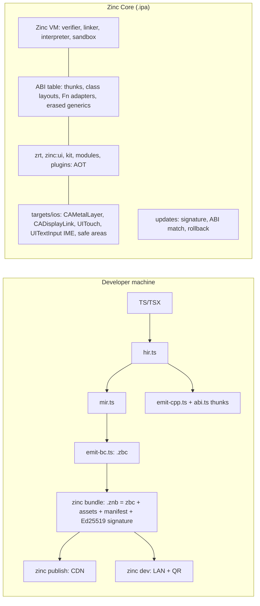

# Zinc Core for iOS: an Expo-like runtime without JIT (design)

Design study, 2026-09-28. Status: proposal. The sources are listed at the end.

## Summary

**The idea:**
- Everything expensive or platform-facing stays compiled ahead of time in the signed app: zrt, `zinc:ui` / Solid / React, the kit, the rasterizer, the modules and plugins, and a new iOS HAL.
- App code runs on a small **typed register VM** (Zinc bytecode `.zbc`), emitted by the compiler from the existing HIR / MIR.

**Three decisions:**
1. **Shared values.** A VM register holds exactly the C++ word of the value's static type (`double`, `int32`, `StrObj*`, `Object*`, `FnObj*`, NaN-boxed `Dyn`). The UI engine and native modules therefore call VM closures and objects with no marshalling, and reference counting behaves exactly as in native code.
2. **The bundle always carries the bytecode of every module.** AOT is a cache keyed by content hash: a module whose hash matches one compiled into the core runs natively, otherwise it is interpreted. The same rule covers promotion, fallback and OTA patches, as in Shorebird's mixed mode.
3. **Production is one app shell per customer, with OTA updates of bytecode.** This is EAS Update's model, allowed by the DPLA §3.3.1(B) interpreted-code clause. A public multi-tenant "Zinc Go" container falls under Guideline §4.7 and is riskier; ship it on TestFlight as a dev client first.

**Expected cost vs native Zinc:**

| Workload | Cost |
| --- | --- |
| Tight compute loops | 3–10× slower (the class of wasm3 and typed register VMs) |
| String / Map / JSON-bound code | 1.2–2× slower |
| UI apps | +5–25% frame time: layout, text and raster stay native |

## App Store constraints

- **Guideline 2.5.2** forbids downloading code that changes features. **DPLA §3.3.1(B)** allows code "interpreted and run by an interpreter engine embedded in Your Application" if it:
  - does not change the primary purpose;
  - stays within permitted features;
  - does not bypass signing or security.

  This is what Expo / EAS Update, CodePush and Shorebird rely on.
- **Guideline 4.7 (revised Nov 2025)** covers HTML5 / JS mini apps, mini games and plug-ins. The host is responsible for:
  - privacy, content filtering and reporting, IAP (4.7.1);
  - no native API exposure without Apple's permission (4.7.2);
  - per-instance consent (4.7.3);
  - an index with universal links (4.7.4);
  - age gating (4.7.5).

  There is also a Mini Apps Partner Program.
- **No JIT for third parties.** `MAP_JIT` is reserved to WebKit; JavaScriptCore.framework in-process runs without JIT. The EU BrowserEngineKit entitlement is for browsers only and is not a path.
- **Precedents:**
  - Hermes bytecode OTA (Expo);
  - Scriptable (JSC), a-Shell (Python / Lua / JS / wasm);
  - UTM SE (QEMU's threaded interpreter, no JIT);
  - Expo Go's SDK 55 build was still awaiting App Store approval in May 2026, a risk signal for public containers.

| Allowed | Not allowed |
|---|---|
| Interpreted bytecode; pre-decoded handler tables (data) | Downloaded dylibs, machine code, wasm AOT artifacts |
| OTA within the reviewed purpose | OTA that changes the purpose or adds permissions |
| Permissions fixed by the binary | Bypassing signing or the sandbox |

## Execution options

| Option | Compute vs native | UI-bound | Risk | Verdict |
|---|---|---|---|---|
| Zinc typed register VM (tail-call threaded, super-instructions) | 3–10× | 1.2–2× | low | **chosen** |
| Switch interpreter over the same bytecode | 8–25× | 1.5–3× | low | first step |
| Embedded QuickJS / Hermes / JSC (no JIT) | 10–80× | 2–10×, plus a marshalling boundary | lowest | optional bridge for arbitrary npm JS |
| Zinc → wasm → wasm3 / WAMR interpreter | 4–15× | poor (zrt interpreted, or copies across linear memory) | low | isolation tier for untrusted code only |

## Architecture

**Core.** `zinc core build --target ios` compiles a core entry that imports every public API. A new `compiler/src/abi.ts` emits:
- per-function thunks;
- class descriptors (field offsets, vtable slots);
- Fn adapters;
- `VmSub_<Base>` classes, so VM classes can extend native ones (React components);
- erased instantiations of exported generics.

The hash of the resulting `core.abi.json` is the runtime version.

**VM.**
- `.zbc` has 32-bit instruction words, pre-decoded at load into handler pointers and dispatched with `musttail`.
- Ops are typed from Sema: `ADD_I32`, `LDF_REF`, `AGET_F64`, `CALL_CORE`, `CHECK` (errors), `SUSPEND` / `RESUME` (async and generators), and `DYN_*` for gradual code.
- Retain and release are explicit ops, with RC elision on MIR.
- Sandbox:
  - the verifier checks types, branch targets and import signatures;
  - no raw pointers or `requireNative` in bundles;
  - capabilities come from the manifest (`targets/capabilities.json` syntax) and can never grow OTA;
  - heap quota, fuel counter and stack limit.

**Dev client.** A QR code connects the device to `zinc dev` over the LAN. Each save sends only the changed modules' bytecode, which should reload faster than the desktop dylib hot reload. The red box and the DevTools inspector come along.

**Mixed mode.** `zinc.json` `"aot": [...]`, or `zinc promote` from the VM profiler, compiles hot modules into the next core. A patched module falls back to its bytecode automatically.

## What exists and what to build

**Reused:**
- the sim oracle and `zinc test`, with a new `--target vm`: sim, native, VM and mixed mode must print the same bytes, which makes a differential fuzzer for the VM;
- pixel goldens;
- zrt and Dyn, `lib/std/*`, the kit, the modules;
- the HIR: only 8 opaque nodes on the conformance suite;
- MIR SSA and folding;
- red box, locations, devtools, capabilities.

**To build:**
- `targets/ios/*`;
- `net_ios.mm`;
- a total HIR, and MIR support for try / async / generators plus an RC pass;
- `emit-bc.ts`, `abi.ts`;
- `runtime/vm/*`: interpreter, loader / verifier, bundle, sandbox, dev client, updates;
- `tests/vm/`.

## Plan (one experienced engineer)

| Phase | Content | Effort |
|---|---|---|
| P0 | iOS HAL; Zinc apps as native iOS apps (Simulator and device, `.ipa`); IME; safe areas; tests on the iOS Simulator | 5–7 weeks |
| P1 | VM for the strict profile, byte-exact on the whole suite | 4–5 months |
| P2 | Dyn / JS through `zinc infer`; optional QuickJS bridge | 3–4 weeks (+6–8) |
| P3 | Signed OTA, dev client, sandbox, profiler, AOT promotion | 2.5–3.5 months |
| P4 | Zinc Go container (TestFlight first; §4.7 compliance if public) | 1–2 months + review risk |

**Risks:**

| Risk | Mitigation |
|---|---|
| Software raster at 3× / 120 Hz | Measure in P0; damage rects; Metal composition; 60 Hz cap |
| VM / native drift | Differential tests on every conformance program |
| C++ template ABI | Erased generics with bytecode fallback |
| Review rejection of a container | Per-customer shells first |
| VoiceOver | Mirror the `zinc:ui` tree as accessibility elements |
| CJK IME | Hidden `UITextInput` with marked text |

## Open questions

1. Per-customer apps with OTA, or a public container of third-party mini apps?
2. Must arbitrary npm JS run (the QuickJS bridge), or are strict / gradual TS and `zinc infer` enough?
3. Which workloads must be near-native in the VM (UI glue only, or games)?
4. Keep the pixel-identical renderer on iOS, or map kit controls to UIKit? Is VoiceOver required?
5. Update hosting and signing keys: self-hosted, or a Zinc service?
6. Minimum iOS version, iPad / Mac Catalyst, Android next (the same VM applies)?

Sources:
- developer.apple.com: App Review Guidelines, the DPLA, the Nov 2025 news on mini apps, alternative browser engines;
- docs.expo.dev: EAS Update and code signing, the FAQ, the May 2026 Expo Go changelog;
- docs.shorebird.dev (performance);
- the READMEs and performance docs of Hermes, wasm3 and WAMR;
- mozilla/platform-tilt#3 (JIT on iOS);
- docs.scriptable.app, holzschu/a-shell;
- saagarjha.com on §2.5.2.
