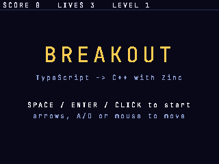
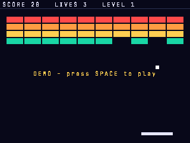

# Targets `ps1` and `ps2`: PlayStation and PlayStation 2

```sh
zinc build examples/breakout --target ps1   # PS-EXE + CD image (docker zinc/sdk-psx: PSn00bSDK)
zinc run   examples/breakout --target ps1   # runs it headless in PCSX-Redux, TTY -> stdout
ZINC_FRAMES=400 ZINC_SHOT=$PWD/examples/breakout/src/build/shot.bmp zinc run examples/breakout --target ps1
zinc test  --target ps1                     # conformance: PS-EXE output vs the fx12 sim oracle
zinc build examples/breakout --target ps2   # EE ELF with gsKit + libpad (docker zinc/sdk-ps2: ps2dev)
zinc run   examples/breakout --profile ps1  # host window with the ps1 profile (fx12, 320x240, 256 KiB heap)
```

The first build of each target builds its docker image (`docker/sdk-psx`, `docker/sdk-ps2`); both are x86_64
images (the SDKs only ship x86_64 Linux binaries), emulated on Apple Silicon.

## What runs where

| | ps1 | ps2 |
|---|---|---|
| output | `build/ps1/cmake/app.exe` (PS-EXE), `app.bin` + `app.cue` (bootable ISO 9660: `SYSTEM.CNF` + `PSX.EXE`), `app.elf` | `build/ps2/cmake/app` (EE ELF, loads at `0x100000`) |
| toolchain | PSn00bSDK v0.24 release (GCC 12.3 `mipsel-none-elf`, `-march=r3000 -msoft-float`) | ps2dev (GCC 15 `mips64r5900el-ps2-elf`, ps2sdk, gsKit) |
| numbers | fixed point Q20.12 (`fx12`), no FPU | `f32` (EE FPU) |
| text output | BIOS TTY (`putchar`/`printf`): PCSX-Redux, DuckStation and dev units show it | `printf` on the EE (ps2link/PCSX2 console) |
| screen | shared software rasterizer → 15 bpp → `LoadImage` into VRAM, damaged rows only, two framebuffers swapped at VSync | rasterizer → CT32 texture in RAM → gsKit texture manager upload → sprite, double-buffered, vsync |
| input | pad 1 through the BIOS pad driver (`InitPAD`) | pad 1 through libpad (`rom0:SIO2MAN`, `rom0:PADMAN`) |
| clock | VSync counter + hblank counter (~64 µs) | `clock()` |
| frame step | virtual 1/60 s per frame (deterministic, like the sim) | same |
| `zinc run` | PCSX-Redux `-cli -testmode -interpreter` with OpenBIOS (no Sony BIOS), stdout = TTY between the HAL markers, exit code from the emulator | builds only (see below) |

Buttons: Cross = A, Circle = B, Square = X, Triangle = Y, L1/R1 = L/R, Start, Select, d-pad (`Btn.*` in `zinc:gfx`).

A `zinc run` build quits after `ZINC_FRAMES` frames (default 60, baked in at build time since a console program
cannot read the host environment); `zinc build` / `zinc export` builds run until the console is switched off.

## Verification status (2026-09-28)

| check | ps1 | ps2 |
|---|---|---|
| conformance suite (`zinc test`) | **9/9 byte-identical with the fx12 sim**, run as PS-EXEs in PCSX-Redux (3 skipped: `ink`, `modules`, `modules_esp32` use modules not available on ps1) | builds; not run |
| `examples/hello`, `examples/breakout` | build and run in PCSX-Redux; hello's output matches the sim; breakout renders (screenshots below) | build; ELF checked with binutils (ELF32 R5900 `EXEC`, one `LOAD` at `0x100000`, gsKit/libpad symbols linked) |
| display | verified in PCSX-Redux (framebuffer read back through its Lua API) | **unverified** (needs PCSX2 + BIOS or hardware) |
| pads | not exercised (headless runs press nothing; breakout's attract mode plays itself) | unverified |
| real hardware | not tried | not tried |
| CD image | built by mkpsxiso; not booted | — |

 

`zinc run` uses PCSX-Redux's interpreter: its x86-64 dynarec, itself running under Docker's x86-64 emulation on
Apple Silicon, sent one conformance executable (`text_react`) into garbage code depending on code layout, while the
interpreter ran the same file correctly. Not investigated further (it may not happen on an x86-64 host).

Speed: breakout runs 400 frames in 1168 vblanks in PCSX-Redux (about 20 fps; its cycle timing is approximate). The
rasterizer is float code on a soft-float CPU and redraws the bounding box of everything that changed, which here
spans most of the screen; a fixed-point path or GPU primitives for plain rectangles and text would be the fix.

## Memory budgets

**PS1** (2 MiB RAM, 1 MiB VRAM): the executable (code + fonts baked by the build) + static pools + the TLSF heap.

| | hello | breakout |
|---|---|---|
| text + rodata | 50 KiB | 231 KiB (≈ 80 KiB of baked glyphs) |
| data + bss | 11 KiB | 137 KiB (two 512-command draw lists 72 KiB, band buffers 40 KiB) |
| TLSF heap (`ZRT_HEAP_BYTES`, profile `heap`) | 256 KiB | 256 KiB |
| left for the stack and the SDK's malloc (after the 64 KiB kernel area) | ≈ 1.6 MiB | ≈ 1.3 MiB |

The draw-list and pool sizes are set in `targets/ps1/ps1.cmake` (512 commands, 4 KiB text, 2 K points per frame);
commands past the limit are dropped. VRAM holds two 320x240 15 bpp framebuffers (300 KiB). The heap size can be
raised per project: `"targets": { "ps1": { "heap": 524288 } }` in zinc.json.

**PS2** (32 MiB RAM, 4 MiB GS memory): 16 MiB TLSF heap; breakout is 360 KiB of code + 1.1 MiB bss (the default 8192-command
draw lists). GS memory: two 640x448 CT24 framebuffers + one 640x448 CT32 texture, at most ≈ 3.4 of the 4 MiB.

## Running on a console or in a GUI emulator

**ps1.** Load `app.exe` in PCSX-Redux (File > Open, with its OpenBIOS or a BIOS dump), DuckStation (needs a BIOS
dump) or no$psx; or mount `app.bin/app.cue`. On hardware: send `app.exe` over serial with a loader (Unirom +
`nops`, or a PSIO/XStation menu), or burn `app.bin` — the image carries no license sector, so a stock console needs a
modchip or a swap-based boot. The TTY is visible in the emulators' console windows or over Unirom's serial link.

**ps2.** PCSX2 needs a BIOS dumped from your own console (Sony's BIOS is not redistributable, so it cannot be put in
the image): Settings > BIOS, then System > Boot ELF > `app`. On hardware: copy `app` to a USB stick and start it
from uLaunchELF / wLaunchELF, or push it over the network with ps2link + `ps2client execee host:app` (the TTY then
shows up in `ps2client`). There is no BIOS-free runner in `zinc run`: PCSX2 has no HLE BIOS. The Play! emulator
boots ELFs without a BIOS (HLE) and has a headless runner that captures the EE's stdout (`tools/AutoTest`), so it is
the candidate for `zinc run --target ps2`. Tried on 2026-09-28: AutoTest builds in the ps2dev image (x86_64) but
segfaults at start under Docker's x86_64 emulation on Apple Silicon; a native arm64 build stops on x86-only `-msse`
flags in its CMake setup. Not wired; worth retrying on an x86_64 Linux host.

## Implementation map

- `docker/sdk-psx/Dockerfile`: PSn00bSDK 0.24 (toolchain, libs, elf2x, mkpsxiso) + PCSX-Redux (x86_64 AppImage,
  extracted), both pinned by sha256; Ubuntu 26.04 because the emulator build needs glibc 2.43.
- `targets/ps1/hal_ps1.cpp`: HAL (TTY, VSync clock, pad, VRAM upload, PCSX-Redux exit/screenshot registers).
- `targets/ps1/crt_ps1.cpp`: what PSn00bSDK's libc lacks: exact number ↔ string conversions and a libm subset.
  `c++ -std=c++17 -O1 targets/ps1/crt_check.cpp && ./a.out` checks them against the host libc.
- `targets/ps1/ps1.cmake`, `iso.xml`, `shot.lua`: link setup (libpsn00b, `exe.ld`, libgcc after libc), pool sizes,
  PS-EXE + CD image, the screenshot slot for PCSX-Redux.
- `targets/ps2/hal_ps2.cpp`, `targets/ps2/ps2.cmake`: EE HAL, gsKit + libpad linking.
- `compiler/src/cli.ts`: the `ps1`/`ps2` entries of `DOCKER` (image, toolchain file, run command).
- Decision: `docs/decisions/0012-playstation-sdk-emulator.md`.
