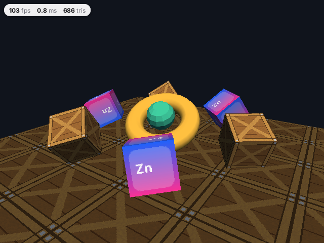

# 3d/cubes

Software 3D with `zinc:3d`: six spinning textured cubes (a baked PNG and a texture painted at runtime with `zinc:gfx`),
a Gouraud-shaded torus with a flat-shaded sphere inside it, a textured floor, and a 2D readout (frame rate, render
time, triangles drawn) over the 3D view. See [docs/plugins/3d.md](../../../docs/plugins/3d.md).



## Run it

```sh
zinc run examples/3d/cubes                     # macOS window, 640x480
zinc run examples/3d/cubes --target sim        # Node (headless)
zinc build examples/3d/cubes --target rpi1     # Raspberry Pi, rendered at half resolution (plugins.3d.scale 2)
zinc build examples/3d/cubes --target esp32    # ESP32 + ST7789 screen, 1/3 resolution with dithering
```

Keys: Left / Right orbit the camera, Up / Down zoom. Every 300 frames the mean render time is printed.

## What to look at

| File | Role |
| --- | --- |
| `src/main.ts` | camera orbit, the frame loop, timing a render |
| `src/scene.ts` | building the scene (meshes, materials, lights, a child node) and animating it; the runtime texture |
| `src/hud.ts` | frame statistics and the readout pill drawn with `zinc:gfx` |
| `assets/crate.png` | the baked texture (own work, CC0) |
