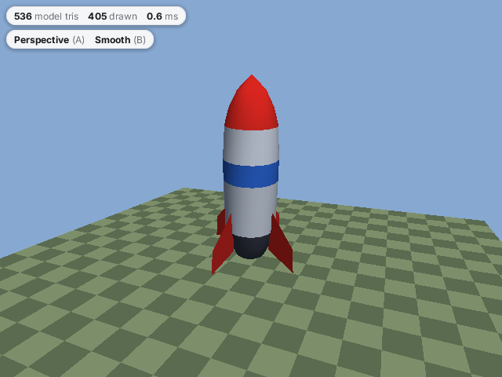

# 3d/model

An OBJ model loaded from the assets (a low-poly rocket with vertex colours; `zinc:3d` computes smooth normals) turning
over a checkered floor, with switchable projection and shading. See [docs/plugins/3d.md](../../../docs/plugins/3d.md).



## Run it

```sh
zinc run examples/3d/model                     # macOS window, 640x480
zinc run examples/3d/model --target sim        # Node (headless)
zinc build examples/3d/model --target rpi1     # Raspberry Pi, rendered at half resolution
zinc build examples/3d/model --target esp32    # ESP32 + ST7789 screen, 1/3 resolution with dithering
node examples/3d/model/make-rocket.mjs         # regenerates assets/rocket.obj
```

Keys: Left / Right orbit, Up / Down zoom, A perspective / orthographic, B smooth / flat shading.

## What to look at

| File | Role |
| --- | --- |
| `src/main.ts` | keys, camera, the frame loop and the readouts |
| `src/scene.ts` | loading the OBJ, lights, the checker floor texture painted at runtime |
| `src/hud.ts` | frame statistics and the readout pills drawn with `zinc:gfx` |
| `make-rocket.mjs` | the Node script that generates the model (a lathed profile with four fins, CC0) |
