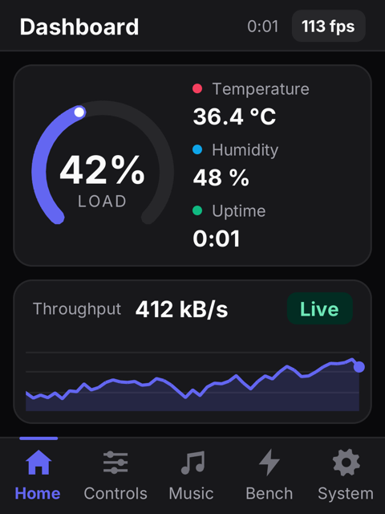
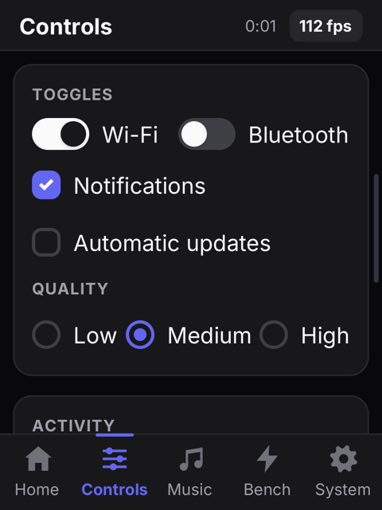
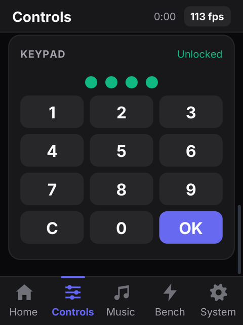
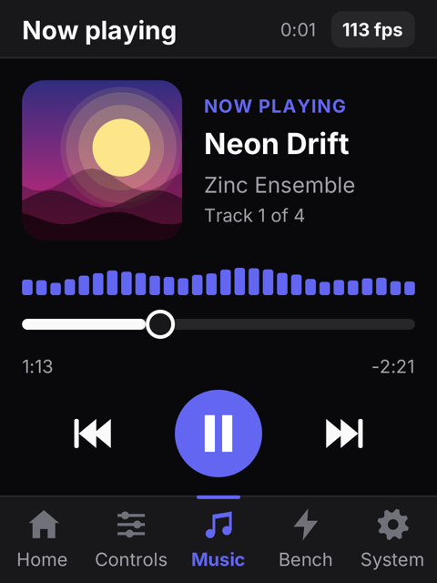
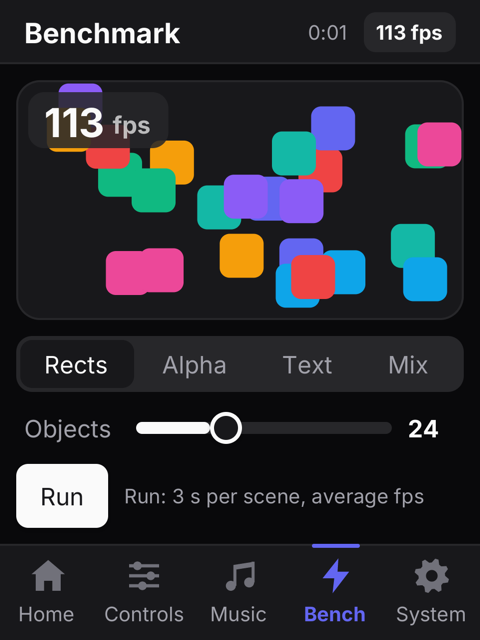
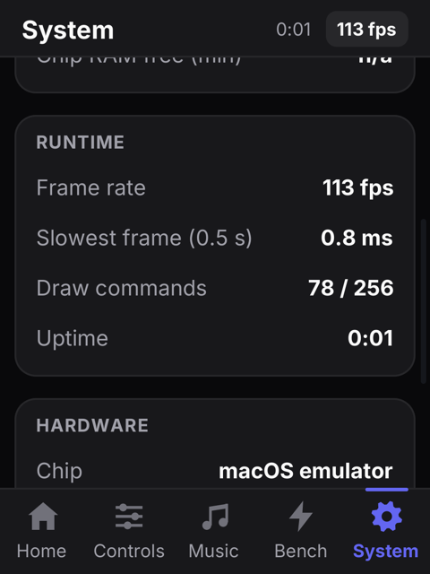
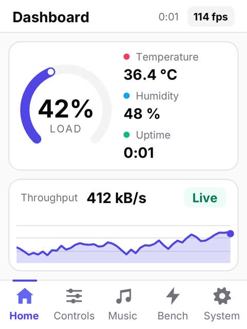

# ESP32-2432S022 widgets demo

An `lv_demo_widgets`-style tour of Zinc on the JCZN **ESP32-2432S022C**, the 2.2" "cheap yellow display" board: a
240x320 ST7789 on an 8-bit parallel bus, CST820 capacitive touch, a plain ESP32 without PSRAM. Five pages behind a
bottom navigation bar, in the `zinc:ui/kit` style (shadcn look) scaled down for a 240 px screen, dark or light.

| | | | |
| --- | --- | --- | --- |
|  |  |  |  |
| **Dashboard**: arc gauge, readings, streaming area chart | **Controls**: kit buttons, sliders (drag), switches, check boxes, radios | the PIN keypad (type 2432) and a spinner further down | **Music**: procedural cover, spectrum, seek slider, morphing play button |
|  |  |  | |
| **Benchmark**: bouncing rects / alpha circles / text / mix, live fps, a timed run | **System**: backlight, theme, auto tour, heap, frame and chip figures | the light theme | |

Screenshots: the macOS emulator (`ZINC_DEMO=<page>[:scroll] ZINC_FRAMES=150 ZINC_SHOT=x.bmp zinc run …`).

## Run it

```sh
zinc run examples/boards/esp32-2432s022                          # macOS emulator: the panel at 2x, the mouse is the finger
zinc build examples/boards/esp32-2432s022 --target esp32         # firmware, ESP-IDF v6.0 in docker (espressif/idf:v6.0)
pip install esptool                                              # once: flashing runs on the Mac (Docker cannot see USB)
zinc flash examples/boards/esp32-2432s022 --target esp32 --port /dev/cu.usbserial-110
zinc monitor --port /dev/cu.usbserial-110                        # the demo prints its figures every 5 s
```

The board's CH340C shows up as `/dev/cu.usbserial-*` (or `/dev/cu.wchusbserial*` with the WCH driver). Its DTR/RTS
lines put the ESP32 in download mode by themselves; if flashing does not start, hold BOOT, tap RST, release BOOT.
BOOT is also the backlight pin (GPIO0): pressing it while the demo runs darkens the screen.

In Espressif QEMU (`zinc run … --target esp32`) there is no I2S LCD peripheral to drive, so add
`"esp32": { "display": { "debug": 3 } }` to `targets` in `zinc.json` for such runs (and remove it before flashing):
the driver skips the bus, the demo finds no touch controller and tours its pages by itself, and the log shows the
heap and damage figures quoted below.

Emulator scripting (`ZINC_DEMO`): a page index (`2` opens the music page playing), `1:600` scrolls the page,
`tour` starts the auto tour, `light` the light theme, `pin` types 2432 + OK on the keypad with synthetic taps and
prints `keypad check: unlocked`. `ZINC_STATS=1` prints the figures every second.

## Hardware

| part | what | notes |
| --- | --- | --- |
| MCU | ESP32-WROOM-32: 2x Xtensa LX6 at 240 MHz, 520 KB SRAM, 4 MB flash, no PSRAM | the preset sets 240 MHz (IDF defaults to 160) |
| display | 2.2" IPS, ST7789, 240x320, 8-bit i80 bus, 65K colours | `st7789` driver, `bus: "i80"` |
| touch | CST820 self-capacitive, I2C 0x15, no INT/RST wired | read each frame as the pointer |
| backlight | N-MOSFET on GPIO0 | LEDC PWM, 5 kHz, 8 bits |
| USB | CH340C with auto-reset | 115200 baud console |
| extras | SC8002B speaker amp on GPIO26 (DAC), TF slot (SPI 5/23/18/19), LiPo charger | not used by the demo |

### Pin map (`boards/esp32-2432s022.json`)

| signal | GPIO | signal | GPIO |
| --- | --- | --- | --- |
| LCD D0 | 15 | LCD WR | 4 |
| LCD D1 | 13 | LCD RD (held high) | 2 |
| LCD D2 | 12 | LCD DC (RS) | 16 |
| LCD D3 | 14 | LCD CS | 17 |
| LCD D4 | 27 | LCD reset | EN (chip reset) |
| LCD D5 | 25 | backlight | 0 |
| LCD D6 | 33 | touch SDA | 21 |
| LCD D7 | 32 | touch SCL | 22 |

Panel settings: MADCTL 0x08 (BGR, portrait), no inversion, no RAM offset, RGB565 high byte first, 20 MHz write clock.
Sources (the vendor's LovyanGFX config, `CST820.cpp`, the schematics) and details: [docs/boards.md](../../../docs/boards.md#esp32-2432s022-jczn-22).

## Files

| file | what |
| --- | --- |
| `src/main.tsx` | the app root, the frame callback, emulator scripting (`ZINC_DEMO`) and the serial figures |
| `src/app/state.ts` | navigation (one page mounted at a time, "shared axis" transition), fps and uptime, theme, backlight, auto tour |
| `src/app/motion.ts` | `Tween`: a signal that eases to a target, advanced once per frame |
| `src/app/sensors.ts`, `music.ts`, `bench.ts` | simulated readings, the player state and spectrum, the benchmark objects and timed run |
| `src/components/Shell.tsx` | title bar, stage, bottom navigation with a gliding indicator |
| `src/components/ui.tsx` | compact kit-style blocks: `Panel`, `Caption`, `InfoRow`, `Checkbox`, `Radio`, `Segmented`; `tk()`, `rgb()` |
| `src/pages/*.tsx` | the five pages |
| `src/draw/charts.ts`, `widgets.ts` | canvas drawing: gauge, area chart, spinner, play/pause morph, skip buttons, album covers |
| `assets/*.svg` | navigation icons (baked to bitmaps at build time) |

## How it fits a PSRAM-less ESP32

The whole UI lives in ~160 KiB of heap, and every UI node costs about half a KiB there (a reactive class or text a
few hundred bytes more). The demo is written for that:

- **one page mounted at a time**: the transition slides the old page out and fades it, unmounts it, then builds and
  slides in the new one, so the heap never holds two pages (state lives in module-level signals and survives);
- **theme colours are read untracked** (`tk()`): classes are computed once and their effects are dropped; switching
  the theme rebuilds the UI on the next frame instead of keeping hundreds of subscriptions alive;
- **one canvas instead of many nodes** where a widget is a grid: the keypad is a button matrix like LVGL's
  `lv_buttonmatrix` (1 node instead of 25), the gauge, chart, spectrum and covers are canvases;
- **no shadows**, hairline borders only: blurred edges cost rasterizer time on every repaint.

Measured on the firmware in QEMU (32-bit, the real memory layout; QEMU does not model time):

| | |
| --- | --- |
| firmware | 1,228 KB `.bin` (1.5 MB app partition, 20 % free); flash data 744 KB (mostly baked fonts), code 416 KB |
| static RAM | DRAM `.data` + `.bss` 93.5 KB of 180.7 KB; IRAM 43.6 KB of 128 KB |
| Zinc heap | 161 KiB in 2 internal RAM blocks, 31 KiB left to ESP-IDF |
| heap use | 123–127 KiB at its peak over the tour (shell + the largest page), stable across page visits |
| draw commands | 77–121 per frame (the esp32 build holds 256) |
| damage sent per frame, steady state | Home 0.9–1.6 K px (1–2 % of the screen), Controls 0.2–0.5 K px, System ~0.2 K px, Benchmark ~23 K px (29 %) |
| full-screen redraws | only page transitions (a few frames each) and theme switches |

The display driver sends only damage: each 12-line band renders the damaged rectangles first, skips the band when
nothing changed, and sends the bounding box of what did. The fps pill, a moving slider thumb or the spinner therefore
cost a few hundred pixels, not the screen.

Emulator (macOS, Apple silicon; `zinc run … --profile esp32` runs it with `f32` numbers and the 160 KiB heap): every page runs at the
runtime's frame cap (113 fps with an 8 ms minimum frame; 60 fps when locked to a visible window's vsync), the slowest
frame of the System page is under 1 ms.

### ESP32 frame budget (estimates, not measured)

- **Transfer**: 8-bit bus at 20 MHz = 10 Mpixel/s: a full screen (76,800 px) is 7.7 ms, the benchmark's 23 K px
  2.3 ms. The ESP32's I2S LCD driver also copies each band into its own DMA buffer with the CPU (~1–2 ms per full
  screen); DMA of one band overlaps the rendering of the next.
- **Rasterization** (software, float coverage near edges): roughly 10–30 cycles per covered pixel and layer at
  240 MHz. A full-stage transition frame (240x240, 2–3 layers) is then 10–20 ms, i.e. transitions around 30–50 fps;
  steady pages draw a few thousand pixels and are bound by the UI paint pass (80–120 commands, diffed against the
  previous frame), a few ms, so they should reach the runtime's cap of 125 fps (8 ms frames) or come close.
- **Touch**: one 5-byte I2C read per frame at 400 kHz, ~0.2 ms.

Check them on the board with `zinc monitor`: the log gives fps, the slowest frame, draw commands and heap every 5 s.

## Not verified (no board was available)

Everything that touches the real hardware: the i80 bus timing at 20 MHz and the byte order on the wire, MADCTL/BGR
and inversion, the ST7789 tuning sequence, the touch orientation (fix with `tswap`/`tflipx`/`tflipy` in the display
options if a tap lands mirrored), the PWM backlight on GPIO0, the real frame rates and the flashing through the
CH340. Verified: the emulator (all pages, the keypad check), the firmware build, and QEMU boots with the heap,
tour and damage figures above.
