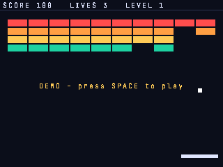

# breakout

A playable brick breaker on `zinc:gfx`, written as a small game project: a state machine for the game rules, a
renderer, an input module. The same code runs in a desktop window, in a browser and on PlayStation 1 / 2 (fixed
point numbers on the PS1). After two idle seconds on the title screen the game plays itself.



## Run it

```sh
zinc run examples/breakout                   # macOS window (SDL3)
zinc run examples/breakout --target wasm     # browser: http://localhost:8080
zinc run examples/breakout --profile ps1     # host window with the PS1 profile (Q20.12 numbers, 256 KiB heap)
zinc run examples/breakout --target ps1      # PS-EXE + CD image, run headless in PCSX-Redux
zinc build examples/breakout --target ps2    # PS2 EE ELF (run it in PCSX2 with your BIOS)
```

See [docs/targets/playstation.md](../../docs/targets/playstation.md) for the console toolchains.

Controls: **Left / Right**, **A / D** or the **mouse** move the paddle; **Space**, **Enter** or a **click** starts and
serves; **Esc** quits. Any key ends the demo.

## What to look at

| File | Role |
| --- | --- |
| `src/main.ts` | the frame loop: read the controls, update the game, draw it |
| `src/game/game.ts` | the rules: phases (title, serve, play, game over, cleared), paddle, ball physics, collisions, score, attract mode |
| `src/game/bricks.ts` | the `Brick` class and the wall of each level |
| `src/input.ts` | buttons and pointer, read once per frame into a `Controls` record |
| `src/render.ts` | HUD, field and the centred messages of each phase (8x8 pixel font, available on every target) |
