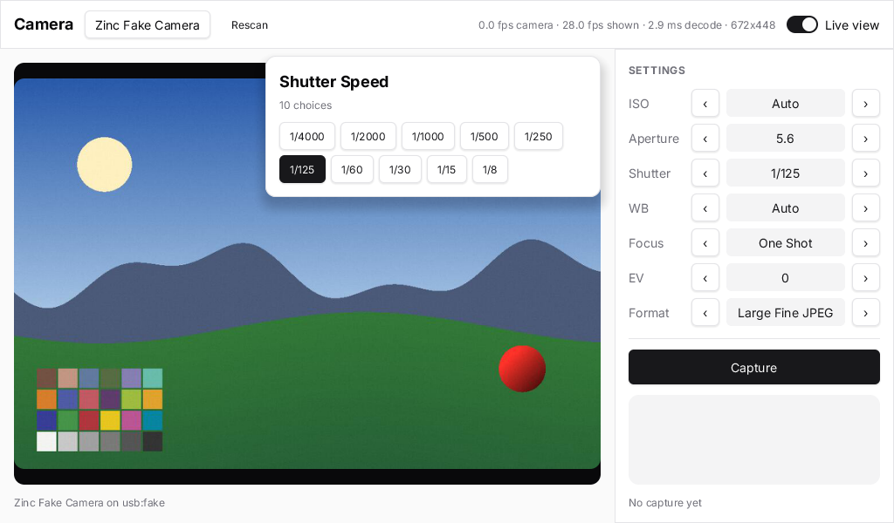

# Camera remote

A tethering app for USB cameras, built on `zinc:gphoto2` ([plugin guide](../../../docs/plugins/gphoto2.md)) and the
`zinc:ui/kit` components: a live view, steppers for the main exposure settings (ISO, aperture, shutter speed, white
balance, focus, exposure compensation, image format), a choice list per setting, and capture with a thumbnail of the
last photo. Photos taken with the camera's own shutter button are downloaded too.



## Run it

```sh
ZINC_FAKE_CAMERA=1 zinc run examples/camera/remote    # macOS, with the built-in fake camera (animated scene)
zinc run examples/camera/remote                       # macOS, with a real camera over USB (PTP mode)
zinc run examples/camera/remote --target sim          # Node: always the fake camera
zinc build examples/camera/remote --target rpi1       # Raspberry Pi (libgphoto2 in the SDK image)
zinc build examples/camera/remote --target linux
```

On macOS the system daemon grabs PTP cameras: quit Photos / Image Capture and run `killall ptpcamerad` right before
starting the app. Captures are written to `captures/` in the current directory.

Controls: click (or arrow keys + Space) the `‹` `›` buttons to step a setting, the value to open its choice list,
**Capture** to shoot; the camera name cycles between cameras when several are plugged in; **Live view** pauses the
preview.

## What to look at

| File | Role |
| --- | --- |
| `src/main.tsx` | layout (top bar, live view, sidebar, popover), the twice-a-second statistics refresh |
| `src/state.ts` | the signals, and `Setting`: a camera widget with its value as a signal |
| `src/session.ts` | everything that talks to the camera: detect, open, settings, capture, live view, events |
| `src/components/LiveView.tsx` | the live view canvas: the plugin decodes and scales frames on its worker, drawing one is a copy |
| `src/components/TopBar.tsx` | camera picker, Rescan, statistics, the live view switch |
| `src/components/SettingsPanel.tsx` | setting rows, the shutter button, the last capture |
| `src/components/ChoicesPopover.tsx` | the floating choice list (a keyed `<For>` over the open setting) |
