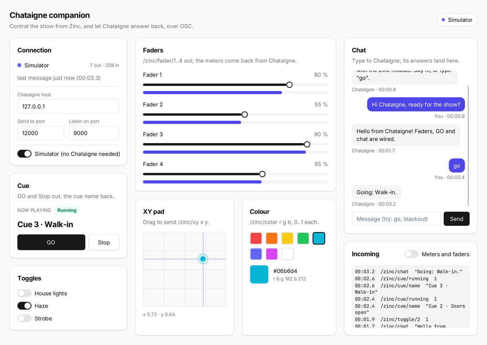

# chataigne

A show-control companion for [Chataigne](https://benjamin.kuperberg.fr/chataigne/), in the Solid model with
`zinc:ui/kit`. It controls Chataigne: four faders, GO / Stop, toggles, an XY pad and colour swatches go out as OSC.
Chataigne controls it back: level meters, the cue name, fader and toggle feedback and a chat come in, and every
received message lands in a log. A built-in simulator keeps the whole screen alive when Chataigne is not running.



## Run it

```sh
zinc run examples/chataigne                          # live: sends to 127.0.0.1:12000, listens on 9000
ZINC_CHATAIGNE_SIM=1 zinc run examples/chataigne     # the built-in simulator, no Chataigne, no sockets
zinc run examples/chataigne --target sim             # headless on Node (always the simulator)

node examples/chataigne/tools/fake-chataigne.mjs &   # a network stand-in for Chataigne (Node, no dependencies)
ZINC_CHATAIGNE_DEMO=1 zinc run examples/chataigne    # scripted gestures: chat, a fader, the pad, a toggle, GO
```

The host and both ports can be changed in the Connection card (they apply on Enter or when the field loses the
focus). The Simulator switch there closes the socket and answers like Chataigne would.

## Set up Chataigne

Chataigne's OSC module listens on **12000** and sends to **127.0.0.1:9000** by default, the mirror image of the app,
so on one machine both sides work without touching a port.

### Open the ready-made project

**File > Open > `chataigne-project/zinc-demo.noisette`**, then run the app. The project needs nothing installed:

| Part | What it does |
| --- | --- |
| Module **Zinc** | a plain OSC module (Protocol > OSC): listens on 12000, sends to 127.0.0.1:9000, with the app's values already declared: `/zinc/fader/1..4` (Float 0..1), `/zinc/cue/go`, `/zinc/cue/stop` (Trigger), `/zinc/toggle/1..3` (Boolean), `/zinc/xy` (Point2D), `/zinc/color` (Color), `/zinc/chat` (String) |
| Custom variable **Zinc > Fader 1** | follows fader 1 (mapping *Fader 1 to variable*, a **Set Value** command) |
| Action **Cue GO** | on `/zinc/cue/go`: sends `/zinc/cue/name "Scene 2"` and `/zinc/cue/running 1`, and plays the sequence |
| Action **Cue Stop** | on `/zinc/cue/stop`: sends `/zinc/cue/name "Stopped"` and `/zinc/cue/running 0`, and stops the sequence |
| Mappings **Meter 1..4** | each fader, remapped to 0..0.85, goes back as `/zinc/meter/n` (a **Custom Message** output) |
| Mapping **Chat echo** | every chat message comes back as a Chataigne bubble |
| Sequence **Fader Sweep** | 4 s, looping: a mapping layer sweeps `/zinc/fader/4` from 10 % to 95 % and back, so Chataigne moves the app's fader |

Press GO in the app: the cue name changes and fader 4 starts moving on its own; Stop halts it.

The file was written by hand from Chataigne's source (1.10.x) and projects it saved, not saved by Chataigne itself:
it has not been opened in a real Chataigne yet. If a part fails to load, the rest still does (Chataigne loads each
item on its own and falls back to defaults), and saving the project from Chataigne rewrites it in its own format.
Mappings only send on change, so the same chat message twice is echoed once.

### With the Zinc module (typed values and commands)

`chataigne-module/` is a Chataigne custom module: an OSC module with named values and commands plus a small script.

1. Copy the folder to `Documents/Chataigne/modules/Zinc/` (the folder name is free, `module.json` must be at its root).
2. Start Chataigne (or **File > Reload custom modules**), then add **Modules > Software > Zinc**.
3. Run the app. Its link turns green ("Receiving"): the module sends a heartbeat (`/zinc/ping`) every second.

Values (set by the app, use them in mappings, conditions or state machines):

| Value | From | Type |
| --- | --- | --- |
| Fader 1..4 | `/zinc/fader/n` | Float 0..1 |
| Toggle 1..3 | `/zinc/toggle/n` | Boolean |
| XY | `/zinc/xy` | Point2D 0..1 |
| Color | `/zinc/color` | Color |
| Cue Go, Cue Stop | `/zinc/cue/go`, `/zinc/cue/stop` | Trigger |
| Chat, Chat Received | `/zinc/chat` | String (last message), Trigger (every message) |

Commands (in any action or mapping; the value parameter follows the mapping input):
**Set Fader**, **Set Meter**, **Set Toggle**, **Set XY**, **Set Color**, **Set Cue Name**, **Set Cue Running**, **Say**
(a chat line). A chat message containing the word `go`, `stop`, `blackout` or `full` triggers Cue Go / Cue Stop or
sends every fader to 0 / 1, and the module answers in the chat.

A typical patch: map an audio module's level to **Set Meter**, send **Set Cue Name** from the actions of each cue of
a state machine or a sequence, and trigger that state machine from **Cue Go**.

### With the plain OSC module

Add **Modules > Protocol > OSC** and keep its ports. With **Auto Add** on (the default) the app's messages create
values as they arrive: `/zinc/fader/1` a Float, `/zinc/cue/go` a Trigger, `/zinc/chat` a String, `/zinc/xy` a Point2D
(but `/zinc/color`, three floats, a Point3D). Send back with the module's **Custom Message** command, e.g. address
`/zinc/cue/name` with one String argument. The app understands both of Chataigne's colour encodings: the default
single `r` argument and three or four floats (**Color Send Mode**: RGB / RGBA Float).

### On two machines

Set **Chataigne host** in the app to Chataigne's IP address. In Chataigne, in the module's **OSC Outputs > OSC
Output**, untick **Local** and set **Remote Host** to the app's machine. Chataigne sends from a random port, so the
app always listens on its own port rather than answering the sender.

## Addresses

| Direction | Address | Arguments | Meaning |
| --- | --- | --- | --- |
| app → Chataigne | `/zinc/fader/1` .. `/4` | float 0..1 | fader moved |
| app → Chataigne | `/zinc/cue/go`, `/zinc/cue/stop` | none | GO / Stop pressed |
| app → Chataigne | `/zinc/toggle/1` .. `/3` | int 1 / 0 | House lights, Haze, Strobe |
| app → Chataigne | `/zinc/xy` | float x, float y (0..1, y up) | XY pad dragged |
| app → Chataigne | `/zinc/color` | float r, g, b (0..1) | swatch picked |
| app → Chataigne | `/zinc/chat` | string | chat message |
| Chataigne → app | `/zinc/meter/1` .. `/4` | float 0..1 | level under each fader |
| Chataigne → app | `/zinc/fader/1` .. `/4` | float 0..1 | moves the fader (feedback) |
| Chataigne → app | `/zinc/toggle/1` .. `/3` | int / bool | sets the toggle (feedback) |
| Chataigne → app | `/zinc/xy` | float x, float y | moves the pad's puck |
| Chataigne → app | `/zinc/color` | 3-4 floats 0..1, 3-4 ints 0..255, or one `r` | sets the colour |
| Chataigne → app | `/zinc/cue/name` | string | cue name in the Cue card |
| Chataigne → app | `/zinc/cue/running` | int 1 / 0 | Running / Idle badge |
| Chataigne → app | `/zinc/chat` | string | chat bubble from Chataigne |
| Chataigne → app | `/zinc/ping` | none | heartbeat (keeps "Receiving" on) |

Everything received is logged with its time since launch; meters, faders, the pad and the heartbeat stream too fast
for a log, so they only appear with **Meters and faders** switched on.

## What to look at

| File | Role |
| --- | --- |
| `src/main.tsx` | entry: simulator / demo switches, mounts the app, advances the clock each frame |
| `src/state.ts` | every value on screen as signals: channels, toggles, pad, colour, cue, chat and log |
| `src/link.ts` | the OSC link (`zinc:osc`): host and ports, listen / close, status, the actions panels call |
| `src/incoming.ts` | `route()`: one received message → the log and the matching signal |
| `src/simulator.ts` | the pocket Chataigne: meters, cue names, feedback and chat answers through `route()` |
| `src/demo.ts` | `ZINC_CHATAIGNE_DEMO=1`: a few timed gestures |
| `src/app.tsx` | the three-column layout and the status pill |
| `src/panels/connection.tsx` | host and port fields, status dot, counters, the simulator switch |
| `src/panels/controls.tsx` | faders with their meters (kit `Slider` + `Progress`), cue transport, toggles |
| `src/panels/surface.tsx` | the XY pad (a `Canvas` drawn with `zinc:gfx`, dragged with pointer events), swatches |
| `src/panels/feed.tsx` | chat bubbles and input, the monospace incoming log |
| `chataigne-module/` | the Chataigne custom module: `module.json` (values, commands, ports) and `zinc.js` |
| `chataigne-project/zinc-demo.noisette` | a ready-to-open Chataigne project (plain OSC module, actions, mappings, a sequence) |
| `tools/fake-chataigne.mjs` | a UDP stand-in for Chataigne that prints both directions |

## Notes

- UDP has no connection: "Listening" means the socket is open, "Receiving" that a message arrived in the last 2 s,
  "Port busy" that another program holds the listen port.
- `zinc:osc` sends a whole number as an `i` argument, so a fader at exactly 0 or 1 goes out as an int. Typed values
  (the Zinc module, or values that already exist) convert it; with Auto Add, the first message decides the type.
- Incoming datagrams are limited to 2048 bytes and OSC bundles are not unpacked (Chataigne sends plain messages).
