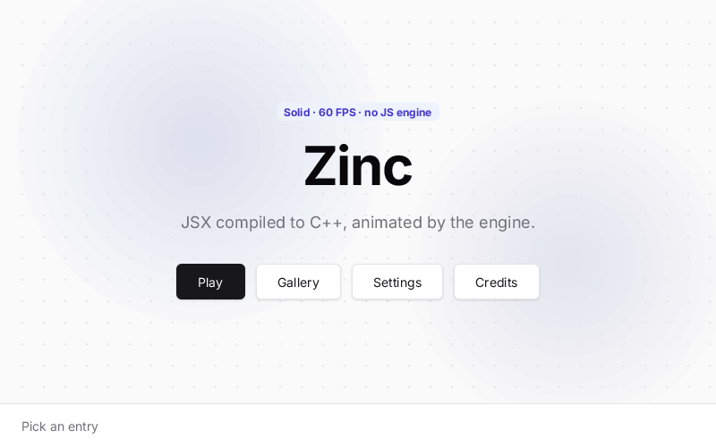

# hero

An animated title screen in the Solid model: a badge, a large title, a tagline and a menu fade in and rise into
place one after the other, over a canvas that draws a dot grid and two slowly drifting glows. A status bar shows the
last choice. (Inspired by PocketJS's Hero screen; original code — the PocketJS original itself is in
`examples/pocket-hero`.)



## Run it

```sh
zinc run examples/hero                  # macOS window (800x500)
zinc run examples/hero --target wasm    # browser
zinc run examples/hero --target sim     # Node oracle (headless)
zinc build examples/hero --target rpi1  # Raspberry Pi (fbdev)
```

Controls: click an entry, or move the focus with the arrow keys / Tab and press Space or Enter.

## What to look at

| File | Role |
| --- | --- |
| `src/main.tsx` | page layout: the canvas with the hero on top, a separator, the status bar |
| `src/state.ts` | the animation clock, the selected entry and the fading "Updated" pulse, advanced by `tick(dt)` |
| `src/motion.ts` | entrance curves: `reveal(delay)` (opacity 0 → 1) and `rise(delay)` (16 px → 0) |
| `src/components/hero.tsx` | badge, title, tagline and the menu built with an inline `MENU.map(...)` |
| `src/components/backdrop.ts` | the canvas `onDraw` callback: plain `zinc:gfx` drawing each frame |

Motion goes through `style={{ opacity, translateY }}`: these are paint-time properties, so the animation never
re-runs layout. Only the nodes whose style reads `time()` update each frame.
