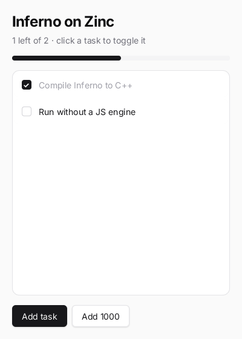

# inferno-todo

An [Inferno](https://www.infernojs.org)-style to-do app — class components, `setState`, `linkEvent`, a virtual
list — compiled to native code. `import ... from 'inferno'` resolves to Zinc's React engine, so the code reads like
an Inferno app, and `zinc:ui/kit` components (`Button`, `Progress`) drop in next to the class components.



## Run it

```sh
zinc run examples/inferno-todo                  # macOS window (400x560; wider windows get md:/lg: spacing)
zinc run examples/inferno-todo --target wasm    # browser
zinc run examples/inferno-todo --target sim     # Node oracle (headless)
zinc build examples/inferno-todo --target rpi1  # Raspberry Pi
```

Controls: click a task to toggle it; **Add task** appends one, **Add 1000** a thousand (the list stays smooth: only
visible rows exist). Scroll with the wheel or by dragging the list.

## What to look at

| File | Role |
| --- | --- |
| `src/main.tsx` | entry: `render(<App />)` like an Inferno app |
| `src/app.tsx` | the `App` class component: state, actions, the virtual list, kit buttons and progress |
| `src/components/todo-item.tsx` | the `TodoItem` class component: checkbox and label, `linkEvent` click handler |
| `src/todos.ts` | the model: `Todo`, pure `toggled` / `withNewTasks` / `remaining` functions |

`tests/conformance/inferno.tsx` drives this app headlessly (add a task, toggle one, print the layout) and checks
that every target prints the same tree.
