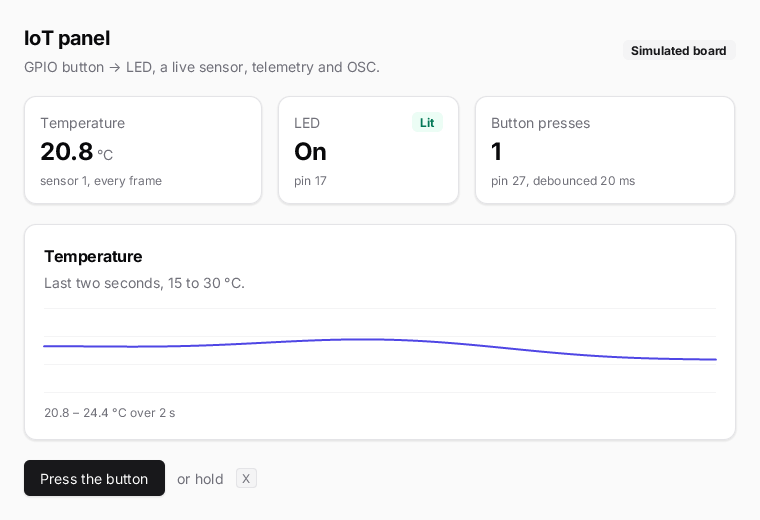

# iot-panel

A small device dashboard in the Solid model: a push button on GPIO 27 toggles an LED on GPIO 17, a (simulated)
temperature sensor feeds a live chart, button presses go to `zinc:telemetry` and out over OSC. On macOS and Linux
the board is simulated; on a Raspberry Pi the same code drives real pins through libgpiod.



## Run it

```sh
zinc run examples/iot-panel                   # macOS window, simulated GPIO
zinc run examples/iot-panel --target sim      # Node oracle (headless)
zinc build examples/iot-panel --target rpi1   # Raspberry Pi (ZRT_GPIOD=1 for real pins)

ZINC_GPIO_SCRIPT="27:0@1000,27:1@1200" zinc run examples/iot-panel          # scripted button presses
ZINC_TELEMETRY=udp://127.0.0.1:9999 zinc run examples/iot-panel & zinc monitor   # live telemetry
```

Controls: click **Press the button**, or hold **X** (pad B) to hold the simulated button down.
OSC messages `/panel/led <0|1> <timestamp ms>` go to 127.0.0.1:9000.

## What to look at

| File | Role |
| --- | --- |
| `src/main.tsx` | entry: sets up the board, mounts the app, samples the sensor and polls the keyboard each frame |
| `src/board.ts` | GPIO setup, the debounced button watcher (LED, counter, telemetry, OSC), simulated presses |
| `src/sensor.ts` | the simulated sensor, its rolling history and min / max, exposed to telemetry |
| `src/app.tsx` | the dashboard: header, three `Stat` tiles, the chart card, the controls (all from `zinc:ui/kit`) |
| `src/components/chart.ts` | the chart's `onDraw` callback: grid lines and an anti-aliased `stroke` of the history |

Every value on screen is a signal read by exactly the node that shows it: a new sample updates the temperature
tile, the range caption and the chart, nothing else.
