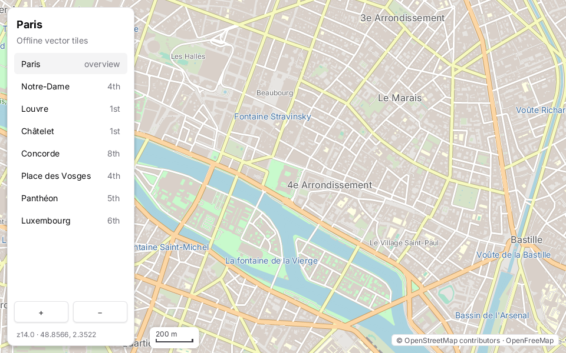

# Map explorer

An offline vector map of central Paris: OpenStreetMap tiles (zoom 10–14 in `tiles/`, overzoomed beyond) rendered by
`zinc:map` ([plugin guide](../../../docs/plugins/map.md)), under a floating `zinc:ui/kit` panel with a list of
places to fly to, zoom buttons and the current position. The scale bar is drawn with `zinc:gfx` on the map canvas.



## Run it

```sh
zinc run examples/maps/explorer                       # macOS, offline tiles
ZINC_MAP_ONLINE=1 zinc run examples/maps/explorer     # + OpenFreeMap tiles for the rest of the world (cached in tile-cache/)
ZINC_MAP_VIEW=48.8606,2.3376,16 zinc run examples/maps/explorer   # start view: lat,lon,zoom
ZINC_MAP_DEMO=1 ZINC_FIXED_DT=0.016667 zinc run examples/maps/explorer   # scripted pan / zoom benchmark, then quit
zinc build examples/maps/explorer --target rpi1       # Raspberry Pi, 800x480 (also linux)
```

`ZINC_MAP_TILES=<dir>` points to another tile directory. The sim target is not supported (the map renderer is
native only).

Controls: drag, wheel or trackpad pinch to pan and zoom, double-click to zoom in; click a place to fly there, `+` / `−`
to zoom around the centre.

## What to look at

| File | Role |
| --- | --- |
| `src/main.tsx` | the map canvas with the panel and the attribution floating over it; the per-frame update |
| `src/map.ts` | the `MapView` (tiles lookup, online mode, start view), gestures limited to the map area, the scale bar |
| `src/places.ts` | the place list data |
| `src/components/PlacesPanel.tsx` | the kit panel: `ListItem` rows with a live `selected`, zoom `Button`s, the position line |
| `src/demo.ts` | the `ZINC_MAP_DEMO` benchmark: six phases, average and worst frame time per phase |

The position line is refreshed five times a second rather than every frame: a text change costs a layout pass.
