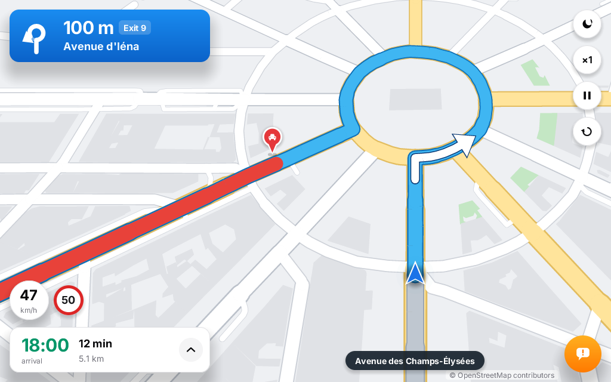
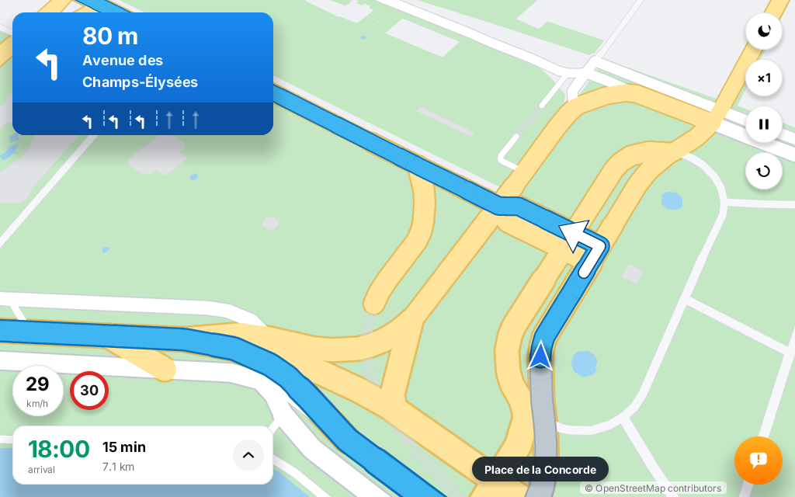
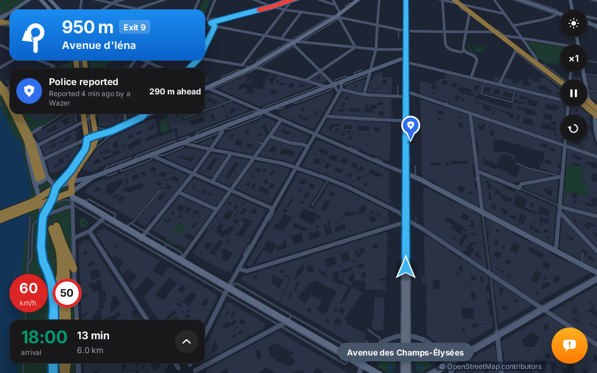
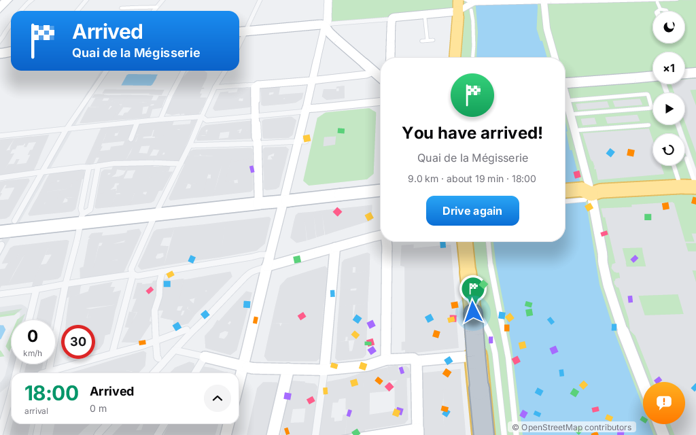

# Navigation

A Waze-style turn-by-turn GPS demo: a simulated drive of 9 km through central Paris on real OpenStreetMap streets.
The map turns so that the direction of travel is up, the car stays in the lower third, and the camera follows it on
springs, tilted a little. Everything is drawn by the Zinc engine at 60 fps, offline: the city and the route are
bundled with the program.



| | |
| --- | --- |
|  |  |
|  | |

## Run it

```sh
zinc run examples/maps/navigation                          # macOS window, 1024x640
zinc build examples/maps/navigation --target rpi1          # Raspberry Pi, 800x480 (also linux)
ZINC_DEMO=roundabout zinc run examples/maps/navigation     # start in a scripted state (list below)
ZINC_DEMO=bench ZINC_FIXED_DT=0.016667 zinc run examples/maps/navigation   # frame time benchmark, then quits
```

`ZINC_DEMO` states: `preview` `drive` `lanes` `roundabout` `alert` `traffic` `speeding` `steps` `report` `panned`
`night` `arrive` `bench`, and `check` (self-checks: the projection round-trips with tilt, the steps are in order,
the trip time is plausible; prints `check ok`); `-- --demo=<state>` does the same on docker targets (which pass only their own `ZINC_`
variables). Screenshots: `ZINC_DETERMINISTIC=1 ZINC_DEMO=night ZINC_FRAMES=90 ZINC_SHOT=night.png zinc run ...`.

## What it does

- **Route preview**: the whole route, north up; it draws itself, then **Go** (or 8 s) flies the camera down to the
  car: position, bearing (the shortest way round), zoom and tilt are interpolated together.
- **Heading-up camera**: the car's position is followed exactly, the bearing and zoom on lazy critically damped
  springs, so the map turns smoothly into the curves. It zooms in before a maneuver and out when driving fast.
- **Route line**: Waze blue with a darker rim, wider than the streets; the driven part is grey; a traffic jam is red;
  a white arrow is painted on the route at the next turn.
- **Instruction banner**: maneuver arrow (turn, slight, sharp, U-turn, roundabout with its exit, arrival flag),
  the distance counting down (50 m steps, then 10 m, then "Now"), the street, the roundabout exit number, lane
  guidance from OSM `turn:lanes`, a "Then" chip when two maneuvers are close. A new instruction slides in.
- **Bottom sheet**: arrival time, time and distance left; tap it for the list of the remaining steps, current first.
- **Speed**: current speed in a bubble that turns red above the limit, the limit sign from OSM `maxspeed`.
- **Simulated drive**: speed from the limit, slower in curves (2.2 m/s² lateral), braking and acceleration limits,
  two red lights, a stretch where the driver speeds on the Champs-Élysées, a traffic jam on Avenue d'Iéna.
- **Waze touches**: police / traffic / hazard pins pop up with a bounce and an alert card slides in; the orange
  report button drops your own pin; night mode crossfades the map palette and switches the kit theme; the arrival
  shows a card and confetti while the camera turns slowly around the destination.

## Controls

| Input | Action |
| --- | --- |
| drag | pan the map (the camera stops following: **Recenter**, or 12 s without touching, brings it back) |
| wheel, trackpad pinch | zoom around the pointer |
| buttons, top right | night mode, simulation speed ×1 / ×2 / ×4, play / pause, restart |
| Space / Enter | play / pause, Go |
| 1 2 4, S | simulation speed |
| N, L, P, R, C | night mode, step list, report menu, restart, recenter |
| + − and arrows | zoom and pan |

## How it is built

| File | Role |
| --- | --- |
| `src/main.tsx` | composition (map canvas under the panels), keyboard, the frame `tick` |
| `src/sim.ts` | the drive: speed profile along the route, red lights, jam, speeding stretch, ETA; dashboard signals |
| `src/camera.ts` | follow / overview / free modes, flights between them, springs, drag and wheel gestures |
| `src/scene.ts` | the map canvas: city, route, maneuver arrow, pins, car, confetti; day and night palettes |
| `src/route.ts` | the route as a function of distance (position, heading, street, limit, next step) |
| `src/route-data.ts` | generated: route polyline, per-segment limits and streets, the steps |
| `src/alerts.ts` | alert pins (bouncy springs), alert card, report menu, toasts |
| `src/app.ts` | night mode, step sheet, preview and Go, restart, arrival |
| `src/icons.ts` | vector icons: maneuvers, lanes, alert glyphs, buttons |
| `src/motion.ts` | `Tween` and `Spring` (from examples/hero) |
| `src/components/` | `Banner`, `Sheet`, `Hud` (speed, buttons, report, alert card, recenter, toast, arrival) |
| `src/demo.ts` | `ZINC_DEMO` states and the benchmark |
| `plugins/citymap/` | project plugin `zinc:citymap`: loads `assets/city.bin`, grid index, culling, `Projection` (rotation, zoom, tilt), level of detail, drawing |
| `tools/build-data.mjs` | builds `assets/city.bin` and `src/route-data.ts` from OpenStreetMap |

### Why a vector map instead of zinc:map

`zinc:map` renders raster tiles north up and caches them as images: turning them every frame would mean
re-rendering every tile every frame (its docs say so for the Pi 1). A navigation view rotates all the time, so this
example keeps the city as vector geometry and draws what the camera sees each frame (`zinc:citymap`, 250 lines):
features near the view come from a 200 m grid, areas of one kind are one `path`, roads are `stroke`s with a casing,
and detail drops with distance and zoom (no buildings far toward the horizon or when zoomed out, minor streets only
up close, points closer than 1.5 px skipped). The perspective tilt is a per-point divide, and stroke widths follow
it per 60 m piece of line. Road outlines need more points per frame than the default `zinc:gfx` pool, so the
plugin raises it (`plugin.json`), like the svg and canvas2d plugins.

### How the data was made

`tools/build-data.mjs` (Node, no dependency) builds both files:

1. **Streets**: an [Overpass API](https://overpass-api.de) extract of the drivable and pedestrian highways of the
   area (6,000 ways, node ids, names, `oneway`, access, `maxspeed`, `junction`, `turn:lanes`), downloaded once with
   `--fetch` into `build/osm-streets.json`.
2. **Route**: Dijkstra over the street graph (one-way streets and access restrictions respected, travel time by road
   class) through eight waypoints, each snapped to a named street: Quai de Conti → Pont de la Concorde →
   Champs-Élysées → Place Charles de Gaulle → Avenue d'Iéna → Cours Albert-Iᵉʳ → Quai des Tuileries → Quai de la
   Mégisserie. The streets it takes are whatever the router finds (Rue de Bassano and Avenue Marceau appear because
   the lower Avenue d'Iéna is one-way).
3. **Instructions**: at each vertex where the street changes, the turn angle over ±18 m gives the maneuver (slight
   < 55°, turn < 140°, sharp, U-turn); a roundabout (`junction=roundabout|circular`) is followed to its exit while
   counting the drivable streets leaving it (the Arc de Triomphe gives "9th exit"); lanes come from `turn:lanes` of
   the approach. Name changes while going straight are silent, like Waze.
4. **Background**: roads by class from the same extract (split into ≤ 120 m pieces for culling); water, parks and
   buildings (only within ~500 m of the route) from the offline OpenMapTiles z14 tiles of `examples/maps/explorer`.
   Everything is simplified (Douglas-Peucker, 0.4–1.2 m) and stored as int16 quarter metres: 18k features, 520 KiB.

```sh
node examples/maps/navigation/tools/build-data.mjs --fetch                 # download the streets once, then build
node examples/maps/navigation/tools/build-data.mjs --svg route.svg         # rebuild + an overview of the route
```

Map data © OpenStreetMap contributors (ODbL); tiles by OpenMapTiles / OpenFreeMap.

## Performance

`ZINC_DEMO=bench ZINC_FIXED_DT=0.016667`: seven phases of 4 s along the route, frame time between frames (not
paced by the display), the whole frame: simulation, UI, map drawing and rasterization.

| phase | macOS, M1 Pro, 1024x640 at 2x (2048x1280 px) | rpi1 binary under QEMU arm1176 on the same Mac (800x480, headless) |
| --- | --- | --- |
| route overview | 3.6 ms avg, 8.6 ms max | 20.2 ms avg, 71.5 ms max |
| quays, 30 km/h | 8.1 ms avg, 10.7 ms max | 7.4 ms avg, 19.7 ms max |
| Place de la Concorde | 9.1 ms avg, 11.9 ms max | 8.7 ms avg, 23.3 ms max |
| Champs-Élysées (60 km/h, zoomed out) | 9.9 ms avg, 13.8 ms max | 14.2 ms avg, 57.3 ms max |
| Arc de Triomphe | 7.3 ms avg, 9.2 ms max | 10.5 ms avg, 34.1 ms max |
| traffic jam | 7.3 ms avg, 10.0 ms max | 7.8 ms avg, 20.2 ms max |
| night, quays | 7.5 ms avg, 10.1 ms max | 9.2 ms avg, 18.6 ms max |

On macOS every phase stays under 16.7 ms, worst frames included: 60 fps with headroom on a Retina screen. The
Raspberry Pi 1 build drops buildings and road casings (`lite` in `scene.ts`), and its screen has 7 times fewer
pixels. The QEMU run is on the null HAL (no framebuffer blit) and QEMU is not a Pi: the map plugin's measurements
suggest a real ARM1176 at 700 MHz is 2.5–4× slower than this emulation, so expect roughly 20–50 ms per frame
(20–40 fps) on a Pi 1 while driving, the route overview slower. Not measured on hardware.

`city.bin` is parsed at start (17.7k features, 115k points): the whole program starts and draws its first frame in
0.2 s on macOS.

## Limits

- No rerouting: the route is fixed (the traffic jam is on it, and costs its delay in the ETA).
- Touch screens: one-finger drag pans; two-finger pinch zoom goes through the trackpad pinch path only
  (`onWheel`), not multitouch.
- No street names drawn along the roads (the banner and the street pill show them).
