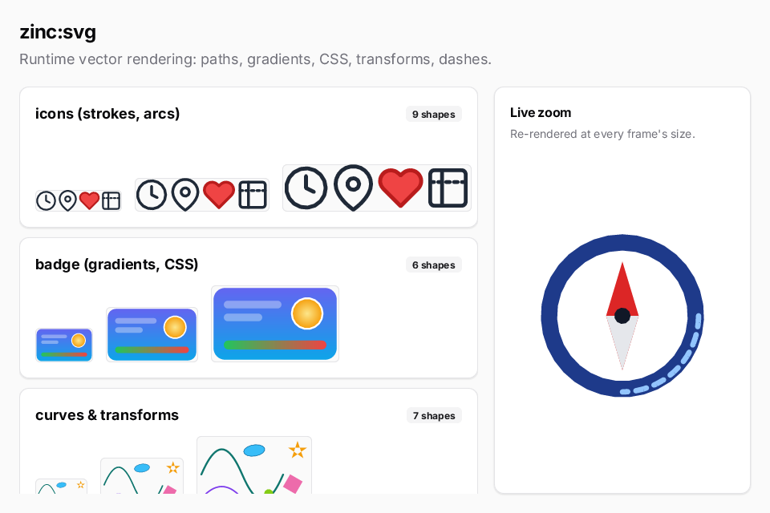

# SVG gallery

Five sample SVG documents parsed and rasterized at runtime by `zinc:svg` ([plugin guide](../../../docs/plugins/svg.md)),
each drawn at three sizes in a kit card (stroked icons with arcs, a badge with gradients and CSS, curves and
transforms, a landscape using `<use>` and `slice`, a compass with dashed arcs), plus the compass re-rendered at a new
size on every frame.



## Run it

```sh
zinc run examples/maps/svg-gallery                   # macOS
zinc build examples/maps/svg-gallery --target rpi1   # Raspberry Pi, 800x480 (also linux)
```

The sim target is not supported (the SVG rasterizer is native only). Scroll the sample list with the wheel or a drag.

## What to look at

| File | Role |
| --- | --- |
| `src/main.tsx` | page layout: title, the scrolling sample cards, the zoom card |
| `src/samples.ts` | the SVG sources, each exercising a part of the supported subset |
| `src/documents.ts` | parsing them once with `new Svg(source)`, reporting parse errors |
| `src/components/SampleCard.tsx` | a card per document; its canvas draws the three sizes, shrunk to fit the width |
| `src/components/ZoomCard.tsx` | the compass zooming between 60 px and the card's size |
