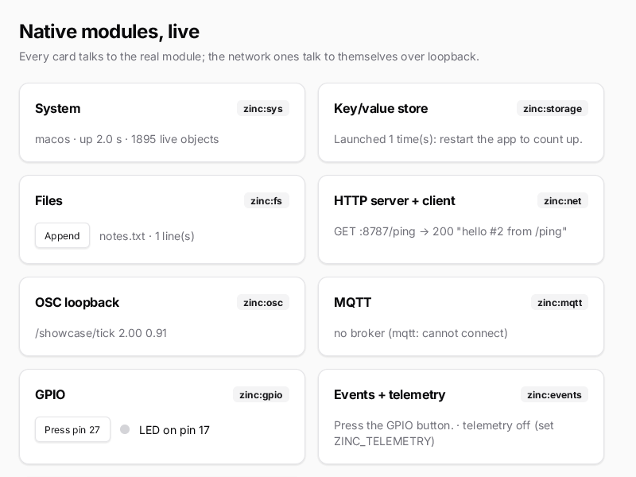

# Native modules, live

One screen, one card per built-in module, each talking to the real implementation:

- `zinc:sys` — platform, uptime, live object count;
- `zinc:storage` — a launch counter that survives restarts;
- `zinc:fs` — a notes file you append to (`showcase-data/notes.txt` in the working directory);
- `zinc:net` — the app serves HTTP on :8787 and fetches itself every second;
- `zinc:osc` — a message a second to its own listener on :9031;
- `zinc:mqtt` — connects to a broker on localhost:1883 if one runs (e.g. `brew services start mosquitto`);
- `zinc:gpio` — a button on pin 27 toggles an LED on pin 17 (simulated on desktops, real pins on Pi / ESP32);
- `zinc:events` + `zinc:telemetry` — each toggle goes through a typed event bus into telemetry
  (`ZINC_TELEMETRY=udp://127.0.0.1:9999` + `zinc monitor`);
- `zinc:assets` — `assets/hello.txt`, embedded in the executable.



## Run it

```sh
zinc run examples/modules-showcase                 # macOS
zinc run examples/modules-showcase --target sim    # Node oracle (headless)
zinc run examples/modules-showcase --target rpi1   # Raspberry Pi build (QEMU)
```

Controls: **Append** writes a line to the notes file, **Press pin 27** simulates the GPIO button. The page scrolls
(wheel or drag) when the window is small.

## What to look at

| File | Role |
| --- | --- |
| `src/main.tsx` | entry: starts the services, refreshes them once a second from the frame loop |
| `src/services/system.ts` | `zinc:sys`, `zinc:storage`, `zinc:fs` |
| `src/services/network.ts` | `zinc:net` server and client, `zinc:osc` loopback, `zinc:mqtt` client (async / await) |
| `src/services/hardware.ts` | `zinc:gpio` button and LED, `zinc:events` bus, `zinc:telemetry` |
| `src/app.tsx` | the page: a wrapping grid of cards in a scroll view |
| `src/components/module-card.tsx` | a kit `Card` with the module name as a `Badge` |

Plugins (video, maps, camera, LED displays, mapping, ink…) have their own examples: see `zinc plugins`.
