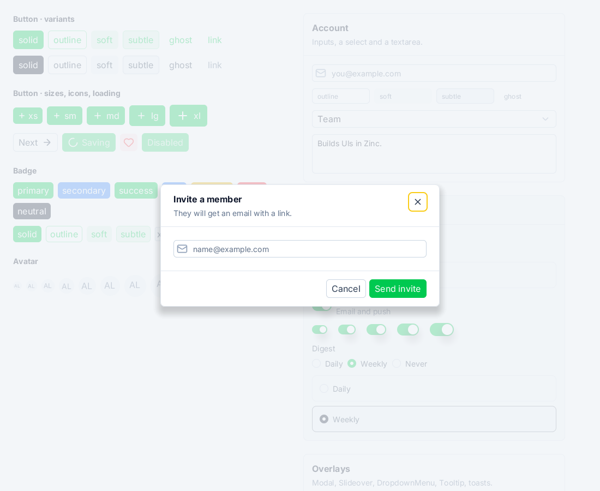
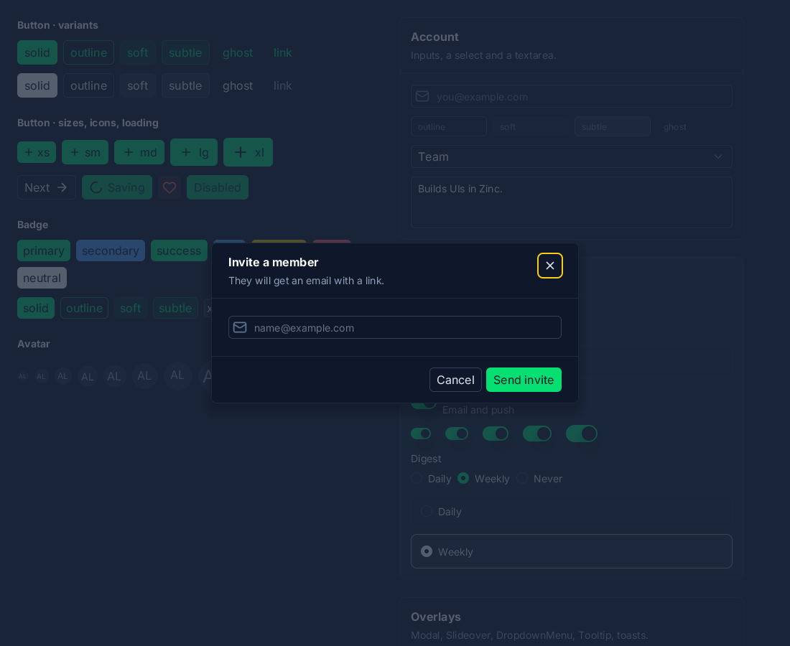
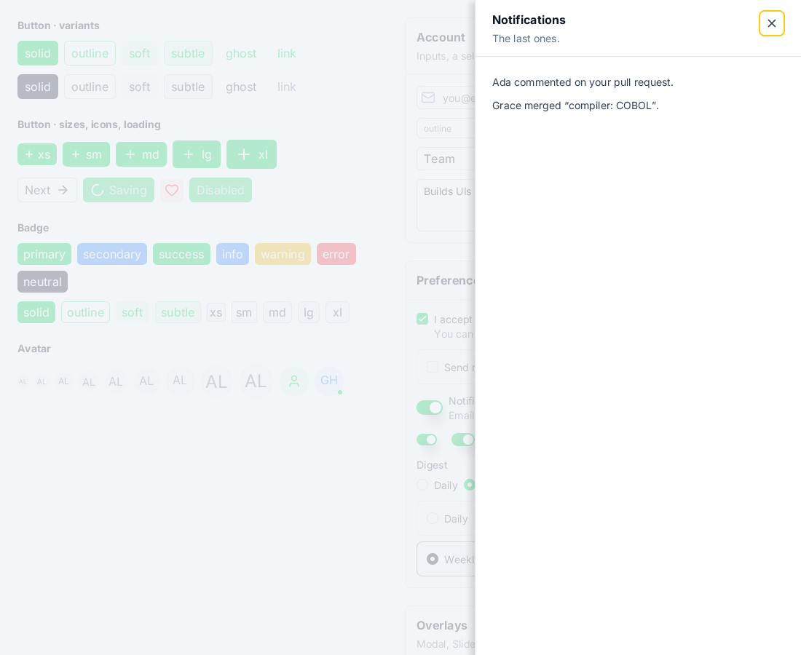
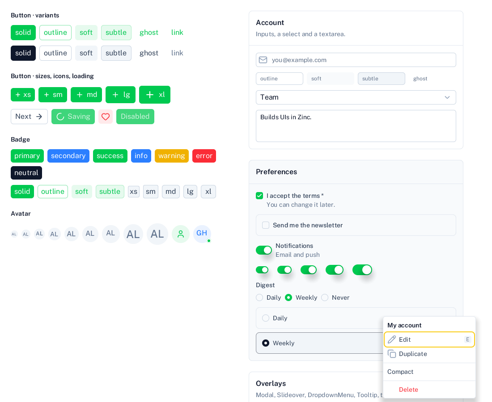
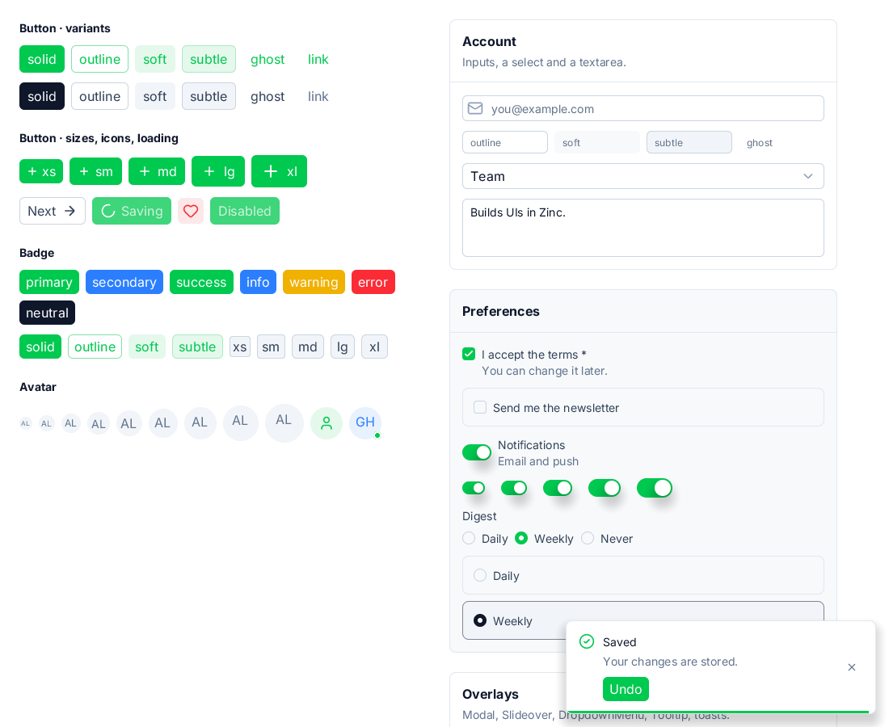
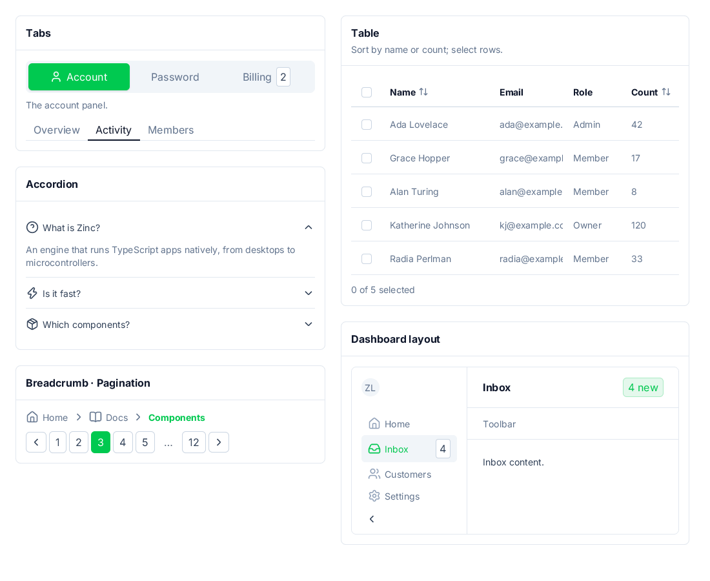
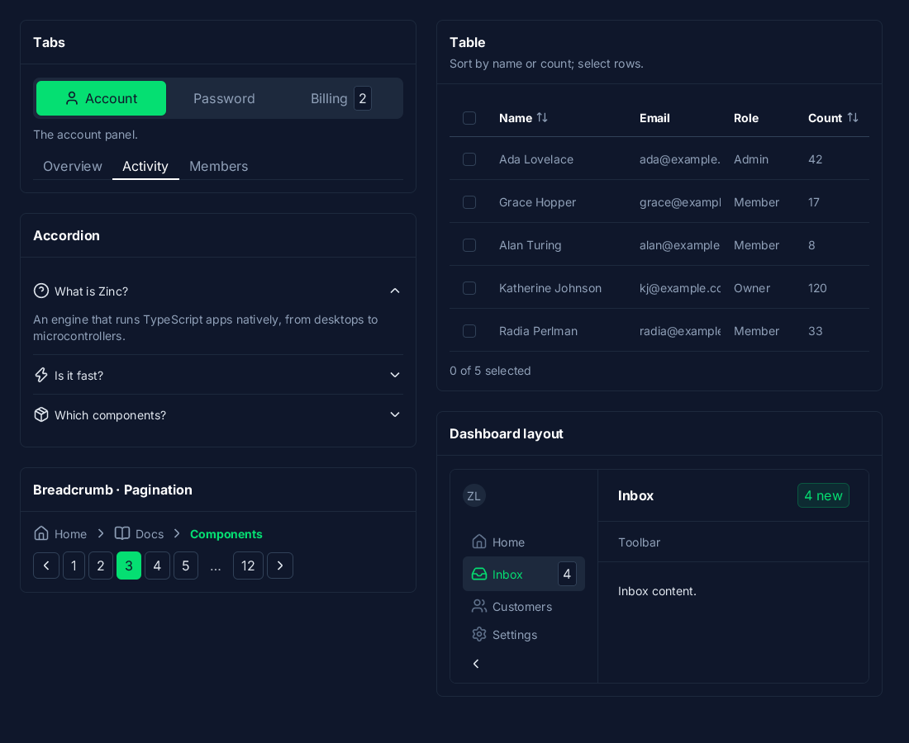

# nuxt-ui

The demo of `zinc:ui/nuxt`, a component kit with the look of [Nuxt UI 4](https://ui.nuxt.com) (ZN-357, decision D38). Today: the gallery of the form and
display components (ZN-357.02) with their variants, sizes and colours, and the overlays (ZN-357.03: Modal, Slideover, DropdownMenu, Tooltip, toasts),
and navigation and data (ZN-357.04: Tabs, Accordion, Table, Pagination, Breadcrumb, NavigationMenu, the Dashboard layout), in the light and the dark
scheme. The dashboard app (ZN-357.05) comes next. Mapping and gaps: `docs/nuxt-ui.md`.

    zinc run examples/nuxt-ui
    NUXT_SCHEME=dark zinc run examples/nuxt-ui
    NUXT_OPEN=modal zinc run examples/nuxt-ui        # or slideover, menu, tooltip, toast
    NUXT_PAGE=navigation zinc run examples/nuxt-ui

| Light | Dark |
|---|---|
|  |  |
|  |  |
|  |  |
|  | |
|  |  |
