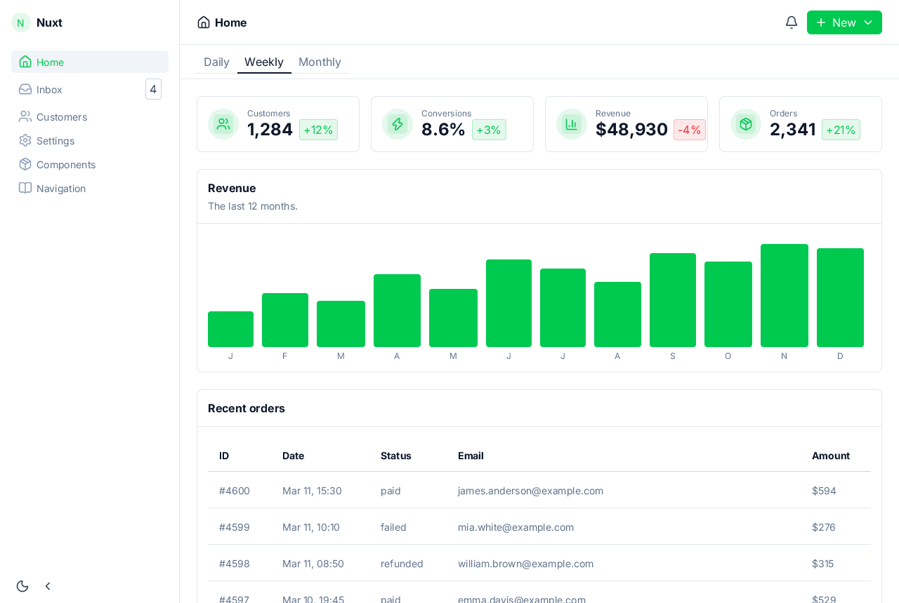
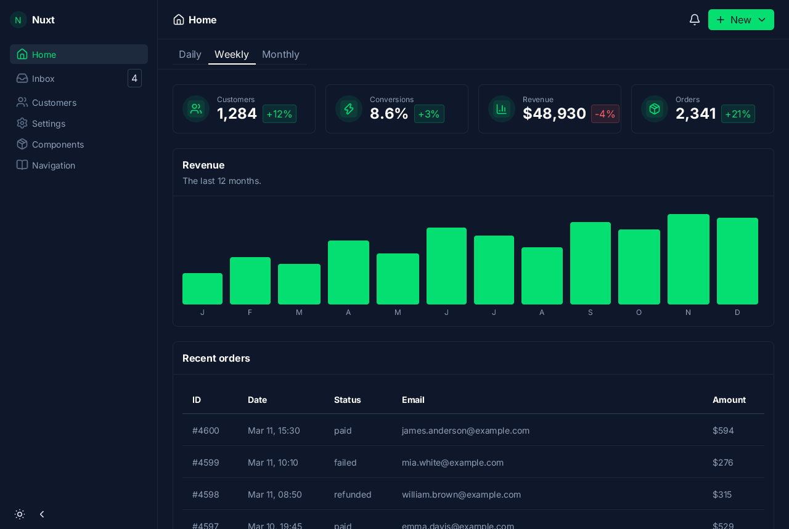
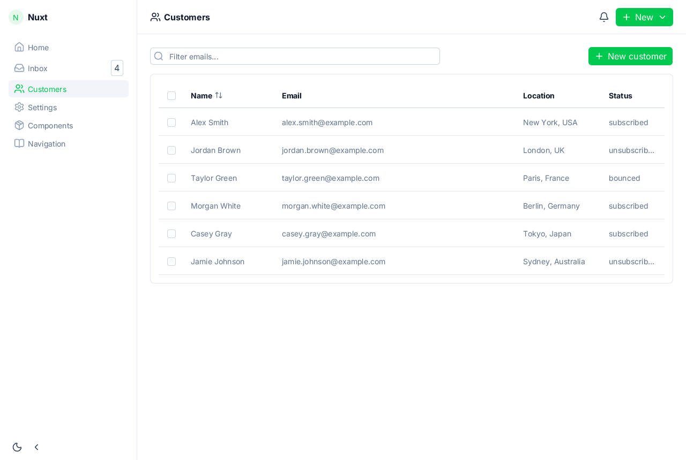
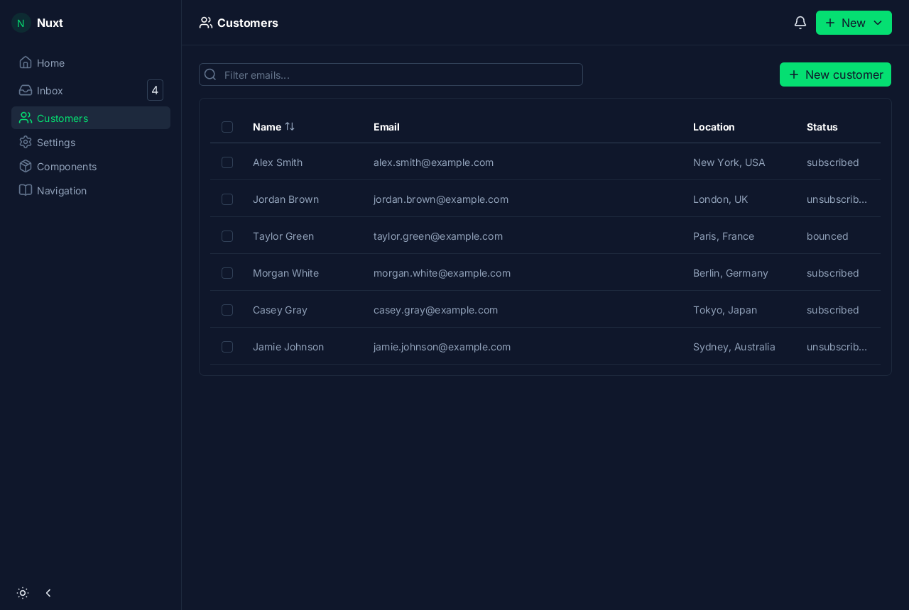
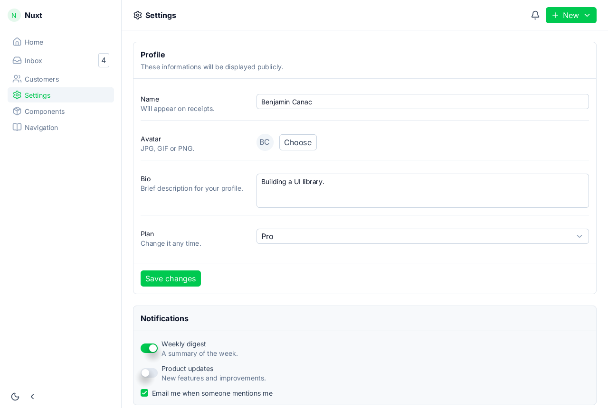
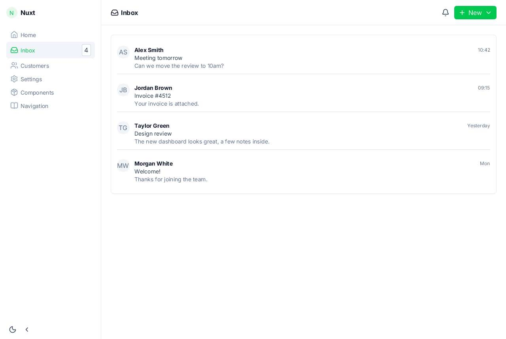

# nuxt-ui

The demo of `zinc:ui/nuxt`, a component kit with the look of [Nuxt UI 4](https://ui.nuxt.com) (ZN-357, decision D38): a dashboard app after Nuxt UI's
dashboard template (a collapsible sidebar, Home with stats, a chart and recent orders, Inbox, Customers with a search, a table and a "New customer" modal,
Settings with forms), and, from its sidebar, the gallery of every component (form and display controls, overlays, navigation and data), in the light and
the dark scheme (the moon button in the sidebar). Mapping and gaps: `docs/nuxt-ui.md`.

    zinc run examples/nuxt-ui
    NUXT_SCHEME=dark NUXT_SECTION=Customers zinc run examples/nuxt-ui     # Home, Inbox, Customers, Settings, Components, Navigation
    NUXT_PAGE=gallery NUXT_OPEN=modal zinc run examples/nuxt-ui          # one gallery alone; slideover, menu, tooltip, toast
    NUXT_PAGE=navigation zinc run examples/nuxt-ui

The checks: `next/tests/t1/nuxt_ui.sh` (15 frame hashes, every control, overlay and dashboard action driven by scripted input).

| Light | Dark |
|---|---|
|  |  |
|  |  |
|  |  |
|  |  |
|  |  |
|  |  |
|  |  |
|  | |
