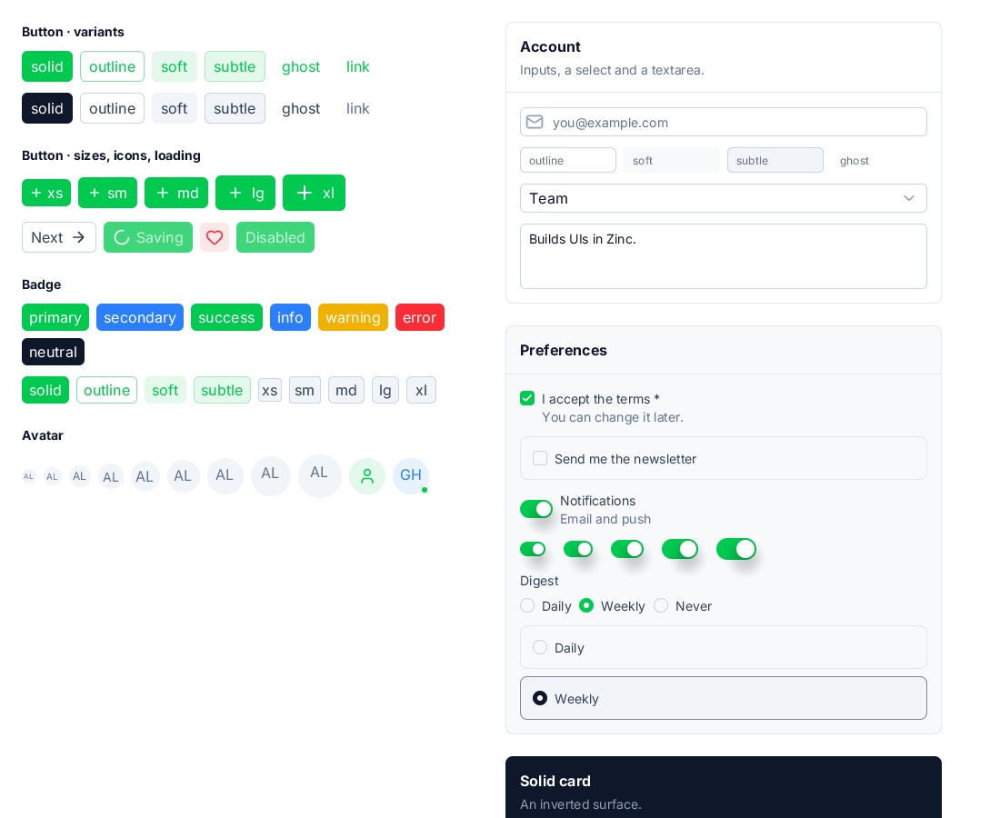
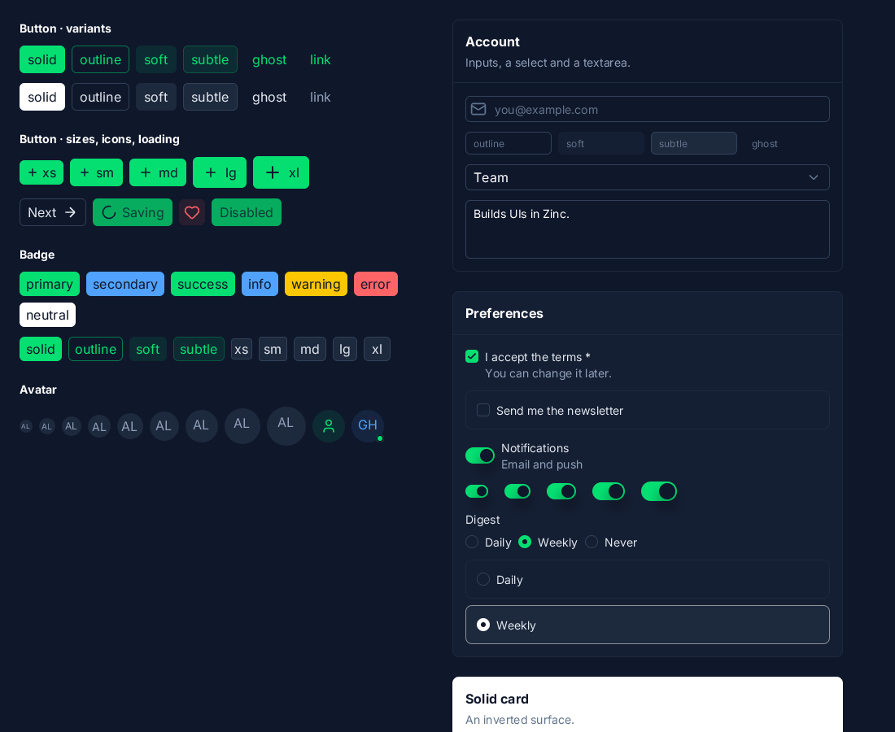

# nuxt-ui

The demo of `zinc:ui/nuxt`, a component kit with the look of [Nuxt UI 4](https://ui.nuxt.com) (ZN-357, decision D38). Today: the gallery of the form and
display components (ZN-357.02) with their variants, sizes and colours, in the light and the dark scheme. Overlays (ZN-357.03), navigation and data
(ZN-357.04) and the dashboard app (ZN-357.05) come next. Mapping and gaps: `docs/nuxt-ui.md`.

    zinc run examples/nuxt-ui
    NUXT_SCHEME=dark zinc run examples/nuxt-ui

| Light | Dark |
|---|---|
|  |  |
