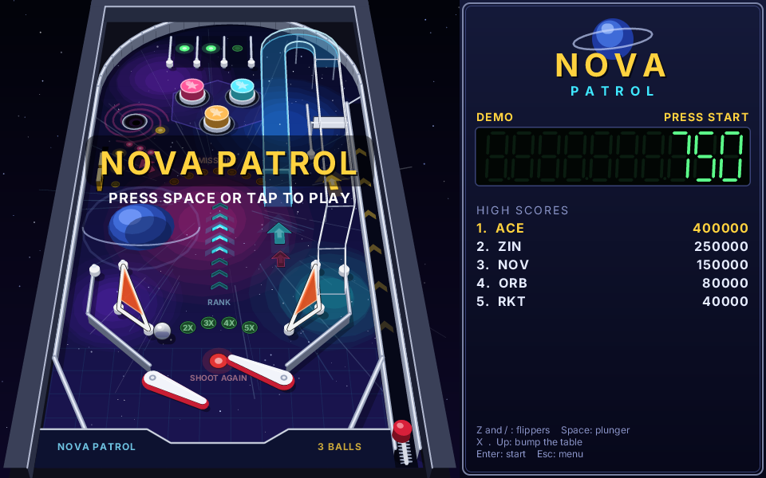
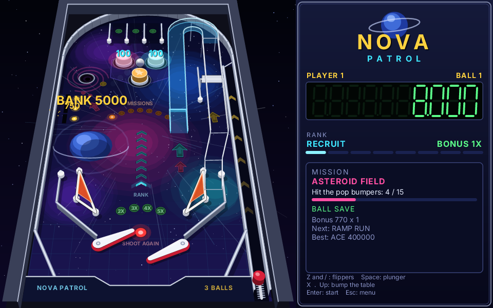
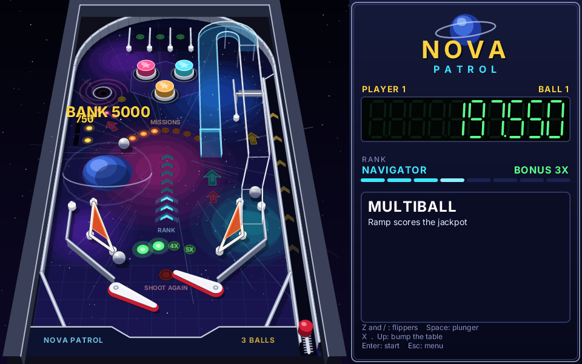
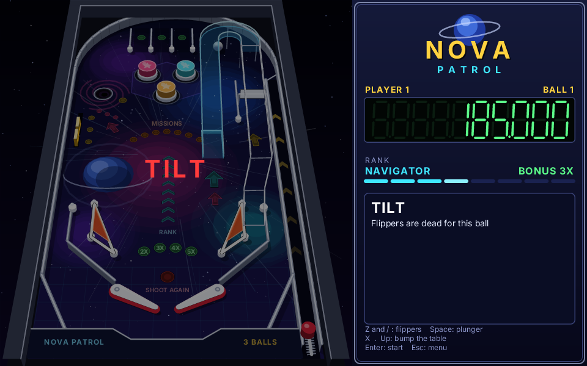
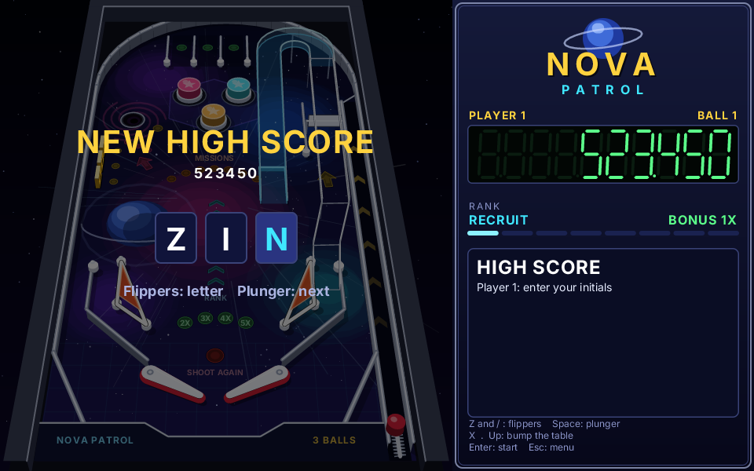

# pinball: Nova Patrol

A space pinball in the spirit of the 90s desktop pinball tables: a tilted table in pseudo-3D on the left, the score
panel on the right. Written in Zinc on `zinc:gfx` alone. The table art is prerendered once, and the physics runs at a
fixed 960 Hz with swept collisions. It plays on macOS at 120 / 60 fps (Retina included) and on a Raspberry Pi.
Everything is original: the table, the names, the art (all drawn in code) and the rules. No assets.



| | |
| --- | --- |
|  |  |
|  |  |

## Run it

```sh
zinc run examples/pinball                        # macOS window, 960x600 (letterboxed when resized)
zinc run examples/pinball --profile rpi1         # the Pi build's layout and effect budget, on the host
ZINC_DEMO=multiball zinc run examples/pinball    # a scripted state (below)
```

## Controls

| action | keyboard | gamepad (zinc:gfx buttons) | touch / mouse |
| --- | --- | --- | --- |
| left flipper | Z, Left, A | L, D-pad left | left half of the table |
| right flipper | / (slash), Right, D | R, D-pad right | right half of the table |
| plunger (hold, release) | Space, Down | A, D-pad down | the side panel |
| bump the table | X (from the left), . (from the right), Up | B, Y, D-pad up | – |
| start / add a player | Enter (Space and the plunger also start) | Start | tap |
| menu | Esc or P (Enter during play) | Start | – |

The menu holds resume, sound on / off, tilt sensitivity (low, normal, high), controls and rules, new game and quit.
Settings and the high score table persist through `zinc:storage`. Left and right Shift cannot stand in for the
flippers: the HAL reports Shift as a modifier without its side, so Z and / are the keyboard flippers.

## Rules

- **Missions**: one at a time, shown on the panel and on the mission lights (the arc under the bumpers). Asteroid
  Field (pop bumpers), Ramp Run, Target Practice (clear the drop target bank), Orbit Spin (spinner), Star Lanes
  (complete the top lanes), Wormhole (kicker hole), Slingshot. Finishing one pays its award times your rank.
- **Rank**: every mission promotes you: Recruit, Cadet, Pilot, Navigator, Commander, Captain, Commodore, Admiral
  (the chevron ladder in the middle of the table). The extra ball lights at Navigator and Commodore. Collect it at
  the wormhole.
- **Multiball**: every third wormhole shot launches two more balls (three in play) with a 12 s ball saver. During
  multiball the ramp scores the jackpot, which grows by 10,000 each time.
- **Top lanes**: light all three for +1 bonus multiplier (up to 5x). The flipper buttons move the lit lanes
  (lane change).
- **Bonus**: most shots add to the ball's bonus, counted times the multiplier when the ball drains.
- **Ball saver**: for 10 s after the launch, a drained ball comes back (the Shoot Again lamp blinks).
- **Tilt**: each bump adds to a tilt meter that drains over time. Past the warning the panel says DANGER. One more
  bump tilts: flippers and kickers die and the ball's bonus is lost.
- 3 balls per player, 1 to 4 players. Press Start again before the first launch to add a player. A score that
  makes the top 5 asks for initials: the flippers change the letter, the plunger moves on.

## How it is built

| path | role |
| --- | --- |
| `src/main.ts` | the frame: controls, rules and physics, table, panel, overlays |
| `src/input.ts` | keyboard, gfx buttons and touch, read once per frame into `Controls` |
| `src/physics/geom.ts` | swept tests: a moving point against a circle and against an inflated segment (capsule) |
| `src/physics/bodies.ts` | materials, segments, circles, sensors and portals, holes, balls, ramps |
| `src/physics/flipper.ts` | the flipper: a solenoid-driven, kinematic tapered capsule |
| `src/physics/world.ts` | the fixed-step simulation, broadphase grid, impulses, layers, events |
| `src/table/layout.ts` | the table: every wall, post, bumper, target, lane, sensor and ramp, in inches |
| `src/game/game.ts` | rules: phases, scoring, missions, ranks, multiball, ball saver, tilt, players, autopilot |
| `src/game/missions.ts`, `store.ts` | missions and ranks; high scores and settings in `zinc:storage` |
| `src/render/camera.ts` | the pseudo-3D pinhole camera (table inches to screen pixels) |
| `src/render/art.ts` | the static table, painted once into an image at the screen's pixel density |
| `src/render/scene.ts` | per frame: lit inserts, mechanisms, flippers, balls, bumper caps, ramps, apron |
| `src/render/fx.ts`, `inserts.ts`, `draw.ts` | popups, rings, sparks, shake; lamp inserts; projection helpers |
| `src/render/quality.ts`, `quality.rpi1.ts` | effect budget; the Pi build takes the `.rpi1` file |
| `src/ui/panel.ts`, `menu.ts` | the side panel (seven-segment score); pause menu, title, initials entry |
| `src/audio/sound.ts` | sound hooks (below) |
| `src/demo.ts` | `ZINC_DEMO` states and the benchmark |
| `tools/feel.ts`, `tools/soak.ts` | physics numbers used for tuning; a 10-minute autopilot run that reports stuck balls |

### Physics

The simulation is pure Zinc: no clock, no drawing. Its only randomness is the kicker's eject jitter and the
autopilot, both from the seeded `Math.random`. It advances in fixed steps of 1/960 s (16 per 60 Hz frame), so the
feel is the same at any frame rate. Units are inches (the table is 20.4 x 42), which keeps every product inside the
Q20.12 range of the fixed-point profile.

- **Swept collisions.** In each substep the ball's move is tested against the walls, posts and bumpers of its grid
  cell (2 in cells, one grid per layer) and against the flippers. It stops at the earliest time of impact, gets
  its impulse, then continues with the rest of the step (up to 4 impacts). Walls are capsules (a segment inflated by
  the ball radius plus the wall's own radius), so the tests are "point against capsule" and "point against circle".
  A last pass pushes out any overlap left by resting contacts. Nothing tunnels at the 380 in/s speed cap.
- **Impulses.** Restitution per material, with no bounce below 3 in/s (resting contact), and Coulomb friction on the
  slip of the contact point. The ball has spin (a solid sphere, I = 2/5 m r²): friction trades spin and tangential
  speed (a tangential impulse j changes the slip by 3.5 j), so a ball rolling off a flipper keeps side spin into the
  next bounce. Bumpers and slingshots add an active kick along the normal. The slingshot only kicks when the ball
  arrives above 7 in/s, like its switch.
- **Flippers.** A flipper is a tapered capsule: a pivot circle, a tip circle and the two lines tangent to both. It
  rotates about the pivot like a solenoid: 2,600 rad/s² up to 44 rad/s while the button is held (a full stroke in
  about 30 ms), a 1,300 rad/s² return spring, hard end stops. It is kinematic (infinite mass). At a contact the
  ball sees the surface velocity ω × (contact − pivot), and both the swept test and the impulse use the ball's
  velocity relative to that surface. That is what gives the feel:
  - a flip hands the flipper's speed to the ball: 85–190 in/s depending on where the ball sits (`tools/feel.ts`);
  - a tap moves the flipper only a little, so a slow ball goes across the table (a tap pass);
  - a flipper held up is a still ramp: the ball rolls down it and settles against the inlane guide (a cradle).

  The button state reaches the coil before the frame's substeps run, so a press moves the flipper in the same frame
  (latency under one frame).
- **Plunger.** A one-sided segment across the shooter lane. Holding pulls it down at 1.4 in/s. Released, a spring
  drives it back and the ball leaves at up to 230 in/s (variable power). A one-way gate at the top of the lane
  stops the ball from coming back.
- **Ramps and habitrails.** The plastic ramp (layer 1) and the wire habitrail (layer 2) each have their own walls.
  Portal sensors across the ramp mouth, the plastic-to-wire joint and the exit move the ball between layers. The
  crossing direction decides: a ball that falls short rolls back down to the playfield. On a ramp, the ball's
  height comes from the ramp's centreline, and the slope adds g·dz/ds downhill (a ramp shot needs about 65 in/s).
  The playfield under the wire stays playable: the spinner lane runs beneath it.
- **Everything else.** Drop targets are segments the rules disable. The spinner is a sensor: a crossing sets its
  speed, and every half turn scores. The wormhole holds a ball that comes in slower than 75 in/s and ejects it
  later. Balls collide with each other. A bump adds a velocity change to every ball (the table moves under them).

`tests/conformance/pinball_physics.ts` replays a scripted run: a plunger launch, a cradle then a flip, a ramp ride
through both layers, and flipper presses. It prints ball positions, layers and an event score every half second.
Sim and native print the same bytes in every profile: f64 (macos, rpi1, rmpp), f32 (esp32) and Q20.12 (ps1).

### Rendering

`render/art.ts` paints the static table (about a thousand commands: backdrop, cabinet, playfield wash and nebulas, planet,
streaks, stars, grid, unlit inserts, shadows, shaded rails, posts, bumper bases, the wormhole, slingshots) into one
image with `beginImage` / `endImage`. The image is baked at `gfx.pixelScale()` (2x on Retina) and drawn at its own
physical size, which makes it a row copy. Per frame, the scene adds only what moves or lights up. It uses about 200
commands, drawn back to front:
- lit lamps and chases, rings and sparks;
- targets, the spinner, the plunger and the flippers;
- balls and bumper caps sorted by depth (a cap hides a ball behind it);
- the translucent ramp and the wire, then balls on ramps;
- the apron and the popups.

zinc:gfx diffs each frame's command list against the previous one and rasterizes only the damaged rectangles.
Around a moving ball, that is a row copy of the image and a few shapes.

The camera is a pinhole behind the table's lower end, pitched 45°, 64 in away. Heights project naturally: a ball on
the ramp rises and shrinks, and its shadow stays on the playfield below. The ball is a chrome sphere (rim, a vertical
light-to-dark gradient, the playfield's reflection, two highlights) with a motion trail above 70 in/s.

On the Pi, `quality.rpi1.ts` replaces `quality.ts`: no trail, no glow halos, 12 sparks instead of 48. The table
art is the same.

### Sound

Zinc has no audio module yet: `targets/capabilities.json` knows an `audio` capability, but nothing implements it.
`src/audio/sound.ts` is the hook. The rules call `play(SFX_…)` for flippers, bumpers, slingshots, targets,
rollovers, the spinner, the ramp, the wormhole, the launch, drains, tilt, missions, rank-ups, multiball, bumps and
extra balls. Each cue carries a recipe for a sound to synthesize at startup (square-wave sweeps and noise bursts
with a linear decay). When an audio back end exists, set `output` to a function that renders the recipe to PCM and
queues it. The menu's sound switch already gates `play()`.

## Demo states and screenshots

`ZINC_DEMO=<state>` (or `-- --demo=<state>`) scripts a state. The autopilot plays, so a run is the same every
time: `attract` (the default), `playing`, `multiball`, `tilt`, `highscore`, `pause`, `bench`. Demo runs never write
to storage.

```sh
ZINC_DEMO=multiball zinc capture examples/pinball --frames 300 --out shots/
```

## Performance

`ZINC_DEMO=bench ZINC_FIXED_DT=0.016667 zinc run examples/pinball` plays three 15 s phases: one ball, multiball, and
the attract mode with its light chase. It prints the frame time (between frames, not paced by the display), the
time of the rules and physics (16 substeps), and the time to record the scene's commands.

macOS on an M1 Pro, 960x600 window at 2x (1920x1200 px), bench runs taken while other builds kept the machine
loaded (load average around 90 on 10 cores):

| phase | frame avg | frame max | rules + physics | scene recording |
| --- | --- | --- | --- | --- |
| one ball | 1.4 – 2.3 ms | 8.5 – 44 ms | 0.009 – 0.013 ms | 0.05 ms |
| multiball, 3 balls | 2.4 – 4.5 ms | 11 – 44 ms | 0.016 – 0.019 ms | 0.06 ms |
| attract, light chase | 3.9 – 6.2 ms | 34 – 75 ms | 0.012 ms | 0.05 ms |

The game's own work per frame is under 0.1 ms: 16 physics substeps, the rules, and recording about 200 draw
commands. The rest is rasterizing the damaged rectangles and presenting. The average frame leaves room for 120 Hz
several times over. The worst frames happen at 1x too (`ZINC_SCALE=1`), so they come from scheduling on the loaded
machine, not from rasterizing: 4–18 % of frames went over 8.3 ms in these runs. The attract phase is the heaviest
because the light chase changes lamps all over the table every frame. The replay is deterministic: each phase ends
with the same score every run (9000, 59500, 2950).

## Raspberry Pi

```sh
zinc build examples/pinball --target rpi1                                   # ARMv6 hard-float binary (docker)
zinc run examples/pinball --target rpi1                                     # under QEMU (arm1176), headless
zinc export examples/pinball --target rpi1                                  # dist/pinball-rpi1: static binary + service
zinc deploy examples/pinball --target rpi1 --device pi@raspberrypi.local    # copy over ssh, install, start
```

The rpi1 build runs at 800x480, scale 1 (`zinc.json`, a common 5" / 7" HDMI or DSI screen). `deploy` copies the
static binary to `/opt/pinball` and installs a systemd service; see [docs/boards.md](../../docs/boards.md). Any
USB gamepad or keyboard works through the zinc:gfx buttons, and a touch screen through the touch zones.

**Expected frame rates: an estimate, not measured on hardware.**

| measurement | play | multiball | attract |
| --- | --- | --- | --- |
| rules + physics, rpi1 binary under QEMU (arm1176) | 0.15 ms | 0.27 ms | 0.15 ms |
| scene and panel recording, same | 0.8 ms | 0.8 ms | 0.8 ms |
| whole frame, rpi1 profile on the M1 host, 800x480, one render thread | 0.5 ms | 0.85 ms | 1.3 ms |

The QEMU run uses the null HAL, which does not rasterize, so it measures only the program's own work. The third row
adds the rasterization, but on a much faster core.

- **Pi 1** (ARM1176, 700 MHz, one core). A real Pi 1 is about 2.5–4x slower than this QEMU emulation (the ratio
  measured for `examples/maps/navigation`), so the program's own work is about 2.5–4.5 ms. Rasterizing is roughly
  40x slower than one M1 core, about 20 / 34 / 54 ms. That gives about 40 fps with one ball, 25–30 fps in
  multiball, and 15–20 fps in the attract chase. The physics keeps its 960 Hz substeps whatever the frame rate
  (up to 48 per frame), so the game plays the same, only less smoothly. Baking the table at startup takes about
  1–2 s (32 ms on the host).
- **Pi 3 / Pi 4** (Cortex-A53 / A72, four cores). The rasterizer splits the damaged rows into bands, one per core.
  About 1.5–4 ms per frame: 60 fps with headroom.

`quality.rpi1.ts` already drops the trail and the glow halos. If a Pi 1 needs more speed, the next steps are to
turn off the attract chase and to lower the substep rate to 480 Hz.

The rpi1 build of the physics test prints the same bytes as the sim oracle under QEMU:
`zinc run tests/conformance/pinball_physics.ts --target rpi1` against `pinball_physics.1280x720.out`.

## Limits

- No sound until Zinc gets an audio output (hooks and recipes are in place).
- The flipper is kinematic: a hard hit does not slow it down.
- Walls do not occlude the ball. Only the bumper caps, the ramp and the apron are drawn over it.
- Shift cannot be a flipper key (the HAL gives no left / right Shift).
