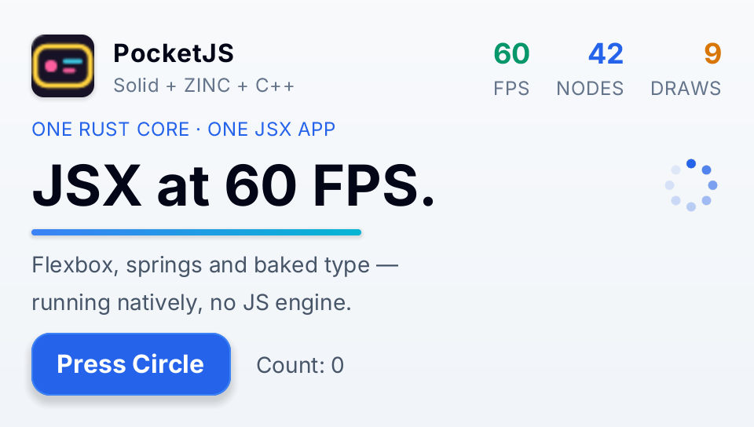

# PocketJS Hero on Zinc

The [PocketJS](https://github.com/pocket-nexus/pocketjs) `apps/hero` demo compiled to native code by Zinc, without a
JavaScript engine. It is a compatibility test as much as a demo: the screen code is PocketJS's own, unchanged.



## Run it

```sh
zinc run examples/pocket-hero                 # macOS window, 480x272 like the PSP viewport
zinc run examples/pocket-hero --target wasm   # browser
zinc run examples/pocket-hero --target sim    # Node oracle (headless)
zinc build examples/pocket-hero --target rpi1 # Raspberry Pi
```

Controls: Space / Enter or a click presses the button; after four presses the "Reactive on real hardware." line
appears.

## What to look at

| File | Role |
| --- | --- |
| `Hero.tsx`, `Hero.ts` | unmodified copies of the PocketJS sources (commit 25081f6, MIT, © 2026 Yifeng "Evan" Wang) |
| `app.tsx` | PocketJS's `app.tsx`, with `mergeProps` replaced by explicit defaults (Zinc has no `mergeProps`) |
| `app.ts` | the `HeroProps` interface |
| `main.tsx` | the PocketJS entry: `mount(() => <Hero presentationHz={TICKS_PER_SECOND} />)` |
| `assets/` | logo, spinner SVG frames and the Inter font, baked at build time |

The `@pocketjs/framework/*` and `solid-js` imports resolve to Zinc's compatibility modules (`lib/compat/pocketjs`),
and lowercase and PascalCase host tags (`View`, `Text`, `Image`) are both accepted, so PocketJS apps compile as they
are. `tests/conformance/pocket_hero.tsx` presses the button five times and checks that every target prints the same
layout. For a Zinc-native take on the same idea, see `examples/hero`.
