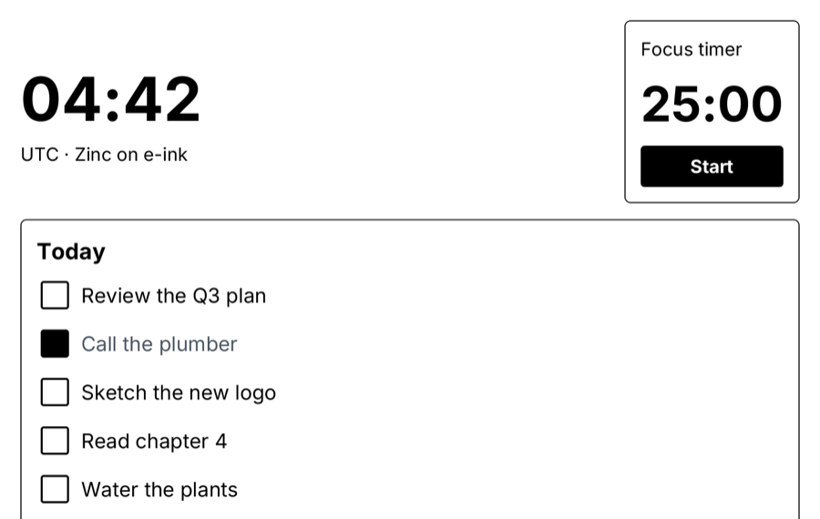

# reMarkable dashboard

A daily dashboard for the reMarkable Paper Pro's colour e-ink screen, written in JSX (Solid model): a large clock,
a 25-minute focus timer, today's tasks, a week of habits and a pen scratchpad. It is designed for e-paper: pure
black and white, thick outlines, large type and targets, no shadows or animation. Only what changes is redrawn (the
clock once a minute, the timer once a second, a tapped task), so `display-rmpp` refreshes small rectangles with its
fast waveform and upgrades them once the screen is idle.



## Run it

```sh
zinc run examples/remarkable/dashboard                    # macOS: e-ink emulator at 1620x2160 (mouse = pen)
zinc build examples/remarkable/dashboard --target rmpp    # static aarch64 ELF (docker zinc/sdk-rmpp)
zinc deploy examples/remarkable/dashboard --target rmpp   # copy to the tablet over ssh and start it
```

Controls: tap a task or a habit day to toggle it, **Start** / **Pause** runs the focus timer, write in the
scratchpad with the pen (the mouse on the desktop).

## What to look at

| File | Role |
| --- | --- |
| `src/main.tsx` | page layout, the scratchpad (`InkCanvas` from `zinc:ink`), the one-second timer |
| `src/state.ts` | clock, timer, tasks and habits as signals; toggles return new arrays |
| `src/components/panels.tsx` | clock, timer, tasks and habits panels; rows built with inline `.map()` |
| `src/eink.ts` | the e-ink class vocabulary (black on white, 2 px outlines, big sizes) |

The light kit (`zinc:ui/kit`) is deliberately not used here: its soft greys and shadows ghost on e-paper.
See [docs/targets/remarkable-paper-pro.md](../../../docs/targets/remarkable-paper-pro.md) for the display pipeline.
