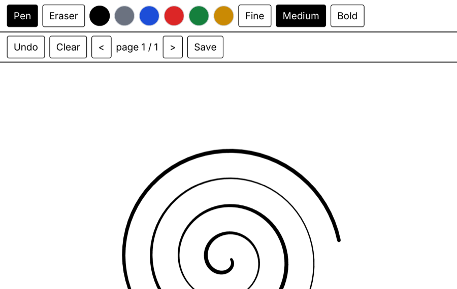

# reMarkable notes

A handwriting notebook for the reMarkable Paper Pro (`zinc:ink` + `display-rmpp`): the pen draws with pressure, the
Marker's eraser end (or the Eraser tool) removes strokes; six colours, three widths, undo, clear, pages, save as
JSON and export as SVG. The toolbars are e-ink friendly: flat black and white, big targets, the active tool inverted.



## Run it

```sh
zinc run examples/remarkable/notes                     # macOS: e-ink emulator at 1620x2160 (mouse = pen, right button = eraser)
NOTES_DEMO=1 zinc run examples/remarkable/notes        # scripted pressure-stroke replay
zinc build examples/remarkable/notes --target rmpp     # static aarch64 ELF (docker zinc/sdk-rmpp)
zinc export examples/remarkable/notes --target rmpp    # dist/notes-rmpp: binary + AppLoad manifest + icon + deploy.sh
zinc deploy examples/remarkable/notes --target rmpp [--device root@10.11.99.1]
```

Pages are saved to `/home/root/zinc-notes` on the tablet, `notes-data/` in the working directory elsewhere.

## What to look at

| File | Role |
| --- | --- |
| `src/main.tsx` | the page: two toolbars, black rules, the `InkCanvas` |
| `src/notebook.ts` | the `Ink` surface, pages, tool / colour / width state, load / save / export |
| `src/components/toolbar.tsx` | tool buttons, colour swatches, page navigation, status line |
| `src/demo.ts` | the `NOTES_DEMO=1` replay: a spiral and two waves fed through the live pen path |

See [docs/targets/remarkable-paper-pro.md](../../../docs/targets/remarkable-paper-pro.md) for the e-ink refresh
strategy and the device setup.
