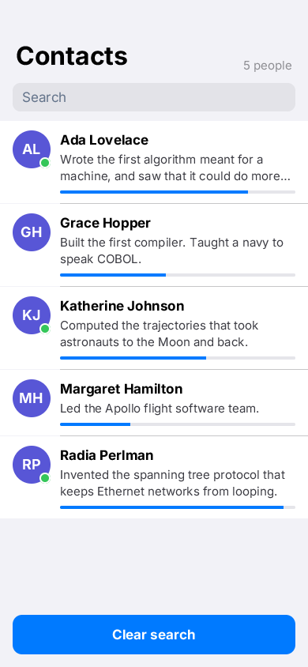

# rn-port

A React Native screen run on Zinc unchanged apart from its two imports (ZN-290): contacts with a search field, a `FlatList`, avatars with an online badge,
two-line bios and percent progress bars. `src/App.tsx` is the React Native component, `src/index.tsx` registers it, `src/inspect.tsx` is the test entry
(`next/tests/t1/rn_port.sh`). Findings and remaining differences: `docs/reports/rn-port-spike.md`.

    zinc run examples/rn-port

