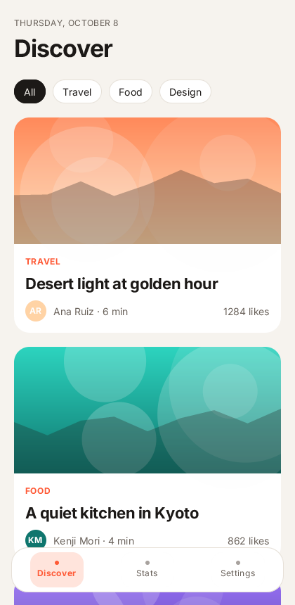
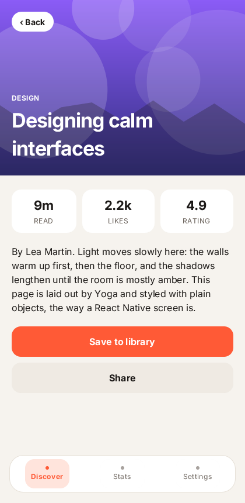
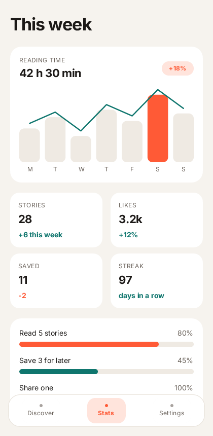
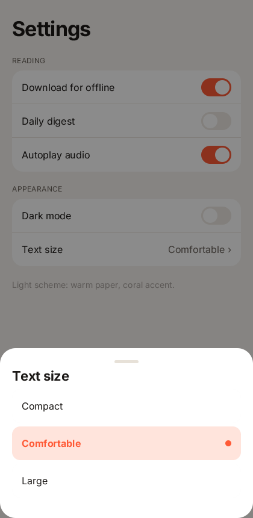
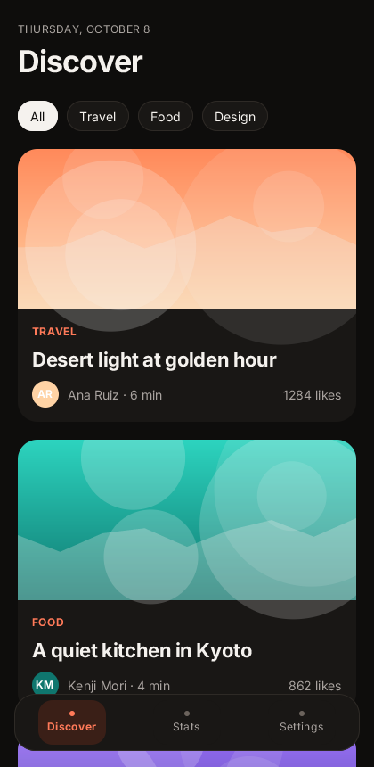
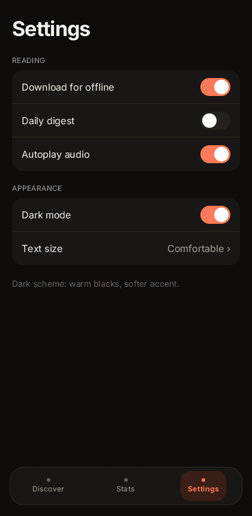

# rn-showcase

A modern app styled the React Native way: `StyleSheet.create` and `style={{...}}` objects only, no class strings and no
UI kit, laid out by Yoga (`"ui": {"layout": "rn"}` in `zinc.json`). It has its own visual language (warm neutrals, a
coral accent, tight large titles, generous radii) in a light and a dark scheme: `src/theme.ts` holds the tokens.

```sh
zinc run examples/rn-showcase
SHOWCASE_SCREEN=stats SHOWCASE_SCHEME=dark zinc run examples/rn-showcase   # open a given state
```

| Discover | Detail | Stats | Sheet | Discover, dark | Settings, dark |
|---|---|---|---|---|---|
|  |  |  |  |  |  |

Screens: a feed of cards with generative covers (`src/art.ts`, drawn on canvases, no image files) and category chips;
a detail page with a hero header; a stats page with a chart, KPI tiles in a wrapping grid and progress bars; settings
with grouped lists, switches whose knobs slide and a bottom sheet with a backdrop. Switches, the sheet and the scheme
ease every frame from the app's tick (`render(App, bg, onTick)`).

## React Native style properties used

`flexDirection`, `flexWrap`, `justifyContent`, `alignItems`, `flexGrow`, `gap`, `width`/`height` (numbers and static
percentages), `padding`, `paddingHorizontal`, `paddingVertical`, `paddingTop`, `paddingBottom`, `position`,
`top`/`right`/`bottom`/`left`, `display`, `overflow`, `backgroundColor`, `color`, `borderWidth`,
`borderBottomWidth`, `borderColor`, `borderRadius`, `opacity`, `translateX`/`translateY`, `fontSize`, `fontWeight`,
`lineHeight`, `letterSpacing`. Colours are numbers from the palette, so a scheme switch is one signal.

## What zinc:ui lacks (each a task)

| Missing | Worked around here by | Task |
|---|---|---|
| `flex` shorthand (basis 0), `flexShrink`, `flexBasis`, `alignSelf`, `alignContent` | `flexGrow` only | ZN-358 |
| `minWidth`/`maxWidth`/`minHeight`/`maxHeight`, `aspectRatio`, dynamic percent sizes | two `flexGrow` views for the progress bars | ZN-359 |
| `shadowColor`/`shadowOffset`/`shadowOpacity`/`shadowRadius`, `elevation` | flat cards on a contrasting background | ZN-360 |
| `transform: [{ rotate }, { scale }, ...]` | `translateX`/`translateY` keys | ZN-361 |
| dynamic enum values (`fontWeight: on ? 700 : 400`, `display`) | conditional named styles (`on() && styles.bold`) | ZN-362 |
| `borderStyle`, per-corner radii, per-side border colours | not used | ZN-363 |

The test `next/tests/t1/rn_showcase.sh` checks that no source uses a class string or the kit, and that the five
states render to their recorded frame hashes in both schemes.
