# rn-tester

The RNTester of `zinc:react-native` (ZN-386): React Native's components and APIs on Zinc, written like React Native code in the React model, one page
each. Pages: Pressable and the Touchables, Switch and ActivityIndicator, TextInput and KeyboardAvoidingView, FlatList (10 000 rows, pull to refresh,
onEndReached, numColumns), SectionList (sticky headers), Animated (timing, spring, interpolate with colours, loop), gestures (PanResponder with
Animated.event and a spring back, a scroll-driven fade), LayoutAnimation, object styles (transform, shadows and elevation, borderStyle, corner radii, side
colours, run-time values) and Platform / Dimensions / PixelRatio / Appearance with a dark scheme.

    zinc run examples/rn-tester
    RN_TESTER_PAGE=flatlist RN_TESTER_SCHEME=dark zinc run examples/rn-tester

Animated values drive React renders through `useAnimated(value)` of `zinc:react-native` (React Native's Animated.View does it for its style). Rotate and skew
hit-test in their shape but paint upright until the renderer takes a matrix (ZN-361.01). The frame hashes: `next/tests/t1/rn_tester.sh`.

| | | |
|---|---|---|
| 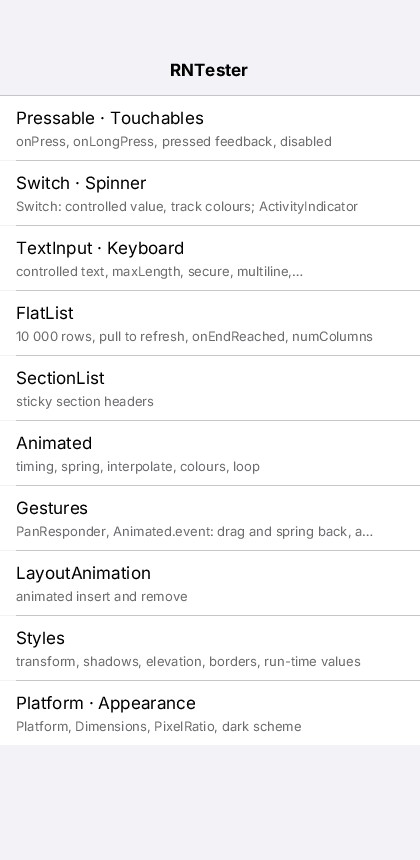 | 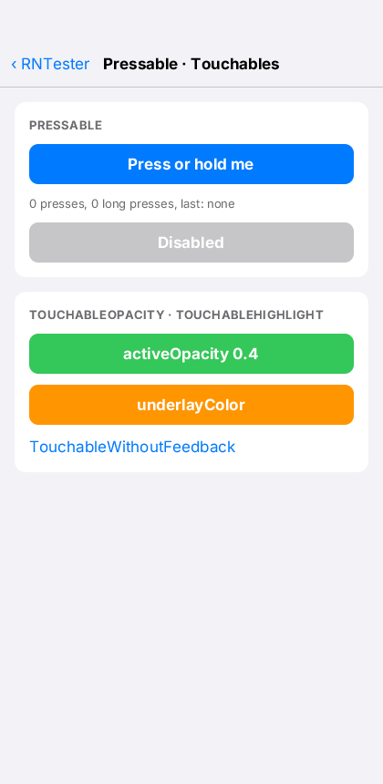 | 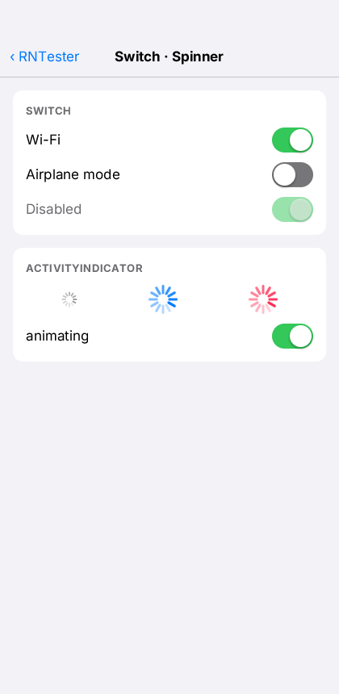 |
| 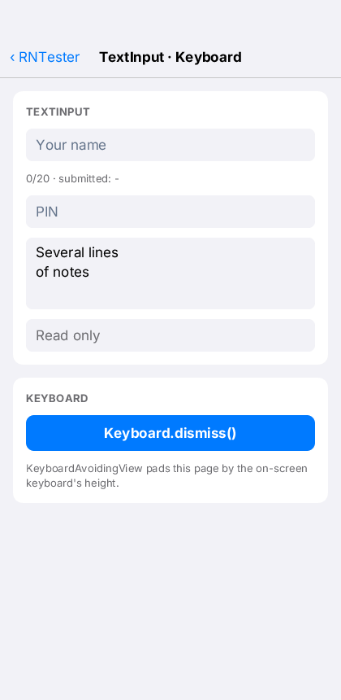 | 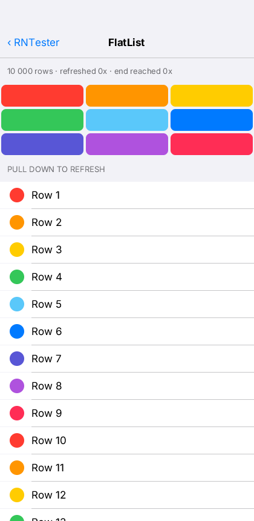 | 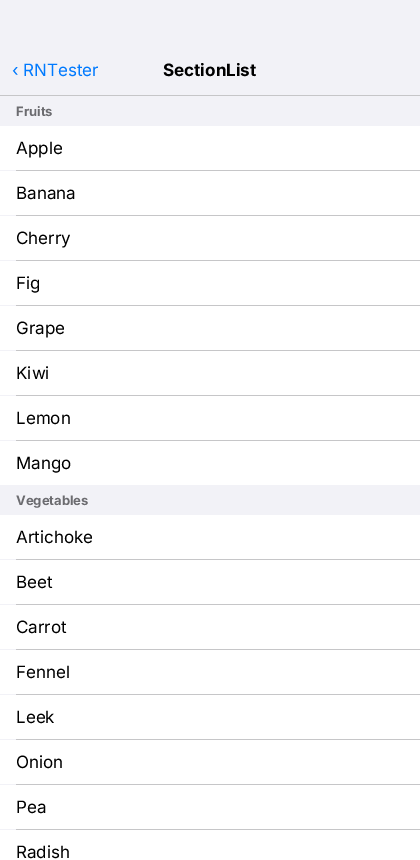 |
| 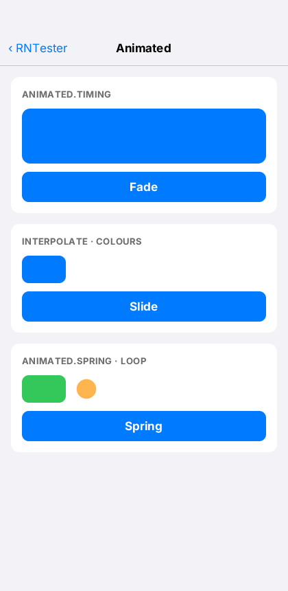 | 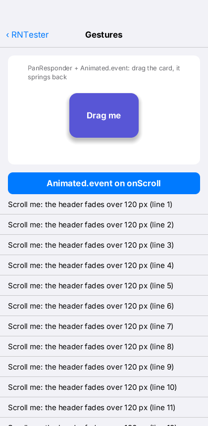 | 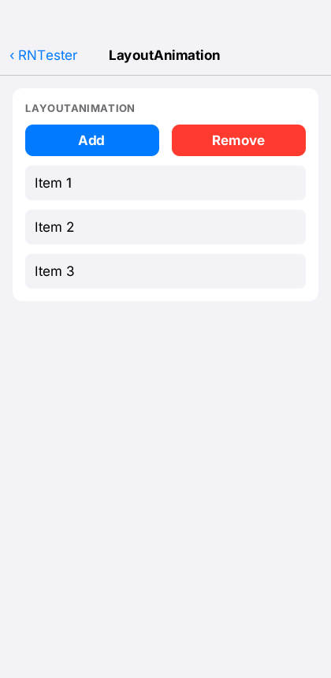 |
| 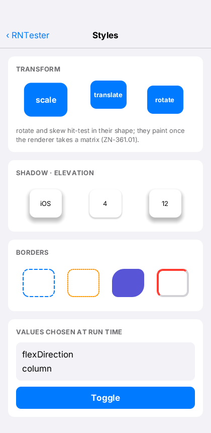 | 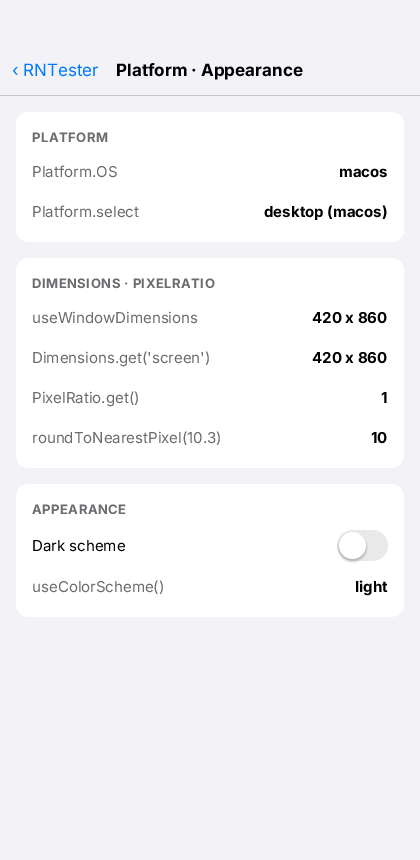 | 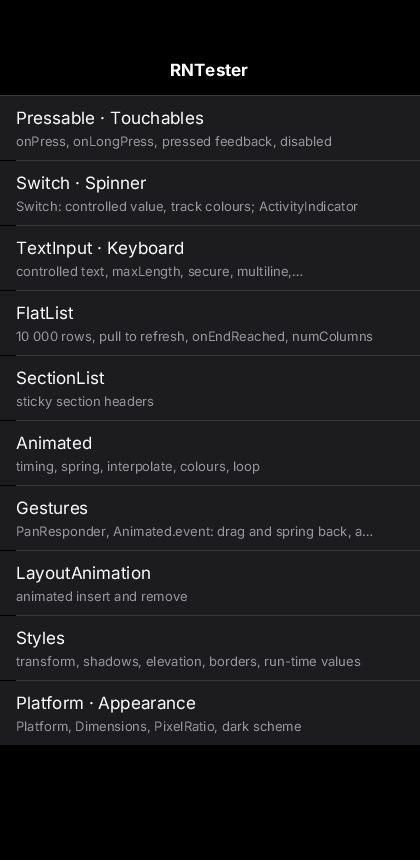 |
| 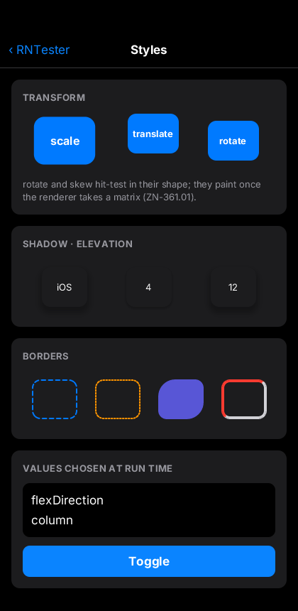 | 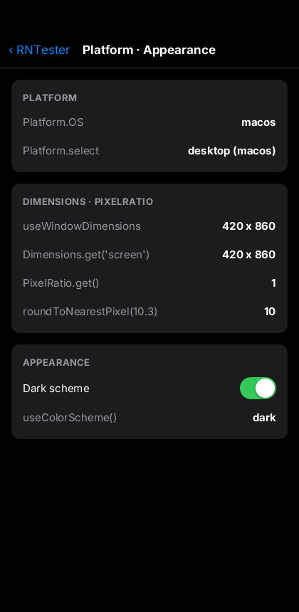 | |
