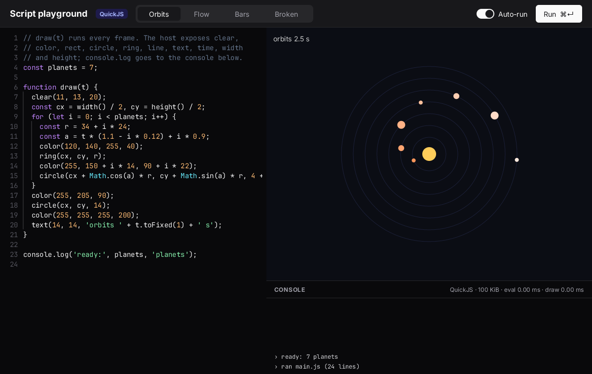
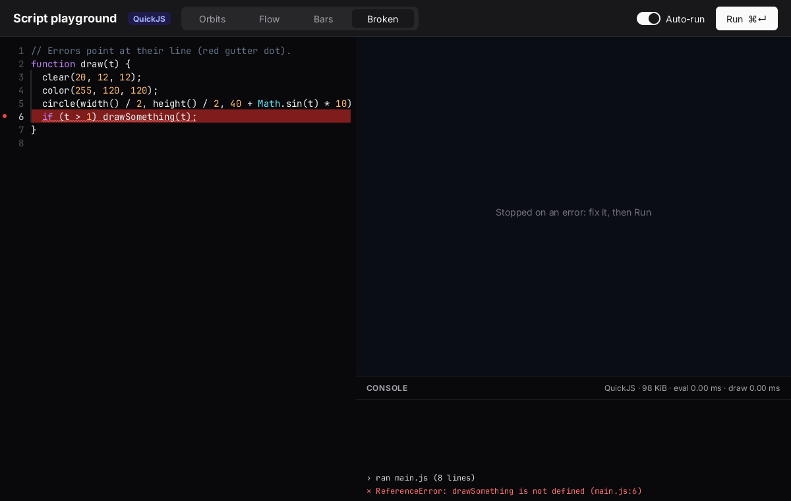
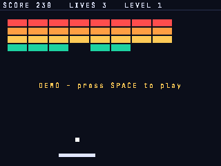

# scripting

Three programs built on [`zinc:script`](../../docs/plugins/script.md): sandboxed JavaScript (QuickJS-ng) inside a
Zinc app.

| example | |
|---|---|
| [`playground`](playground) | live coding: a code editor on the left, a canvas driven by the script on the right, a console |
| [`breakout-mods`](breakout-mods) | [breakout](../breakout) whose rules (serve speed, speed-up, scoring) come from a mod, `assets/rules.js` |
| [`bench`](bench) | the costs in the plugin docs: context creation, eval of 1 KB, call overhead both ways, limits |

```sh
zinc run examples/scripting/playground
zinc run examples/scripting/breakout-mods
zinc run examples/scripting/bench                # and --target sim for the node:vm numbers
```

They build for macOS, Linux, Raspberry Pi and the reMarkable Paper Pro. The plugin needs 4 MiB of heap
(`requires: ["heap>=4M"]`).

## playground



- The editor is a code textarea (`lineNumbers`, highlighting). **Run** or **⌘/Ctrl+Enter** runs the script;
  with **Auto-run** on, it re-runs 400 ms after each edit. Each run gets a fresh context (16 MiB, 50 ms per
  call).
- The script defines `draw(t)`, which the canvas calls every frame. It draws through the host functions:
  `clear`, `color`, `rect`, `circle`, `ring`, `line`, `text`, `time`, `width`, `height`. Each is a typed Zinc
  closure passed to `vm.expose` (`src/runner.ts`); a small prelude adds default arguments and `console.log`.
- An error stops the drawing and goes to the console with its location. Its line is marked in the editor:
  red background, gutter dot, squiggle (`ui.setMarks`).



`ZINC_DEMO=<n>` opens sample n (0–3) at start, for screenshots.

## breakout-mods



- The game code is examples/breakout's, unchanged, apart from a `Rules` interface on `Game` (`DefaultRules` is
  the original game).
- `src/main.ts` implements `Rules` by calling the mod's exported functions:
  - `serveSpeed(level)`;
  - `speedUp(speed)`;
  - `points(base, level, combo)`: the shipped mod scores combos, up to ×5 for the fifth brick in a row.
- The mod runs with a 1 MiB, 5 ms budget and sees only `log`.
- A rule the mod does not export, or one that throws or returns a non-number, falls back to the game's own
  rule. The failure is logged once.

## bench

Prints the numbers of the [Measurements](../../docs/plugins/script.md#measurements) table.
