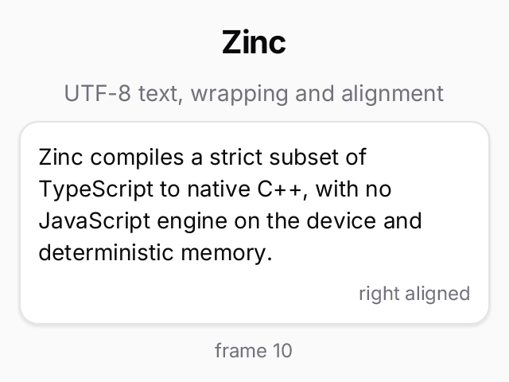

# text

One small screen of text (a title, a subtitle, a wrapped paragraph in a card, right-aligned and centred lines, a
frame counter), written twice: once in the Solid model and once in the React model. Both produce exactly the same
layout; `tests/conformance/text_solid.tsx` and `text_react.tsx` check it on every target.



## Run it

```sh
zinc run examples/text                          # Solid model (zinc.json entry), macOS window
zinc run examples/text/src/main-react.tsx       # the same screen with the React engine
zinc run examples/text --target wasm            # browser
zinc run examples/text --target sim             # Node oracle (headless)
```

No controls: the frame counter at the bottom is the only thing that changes.

## What to look at

| File | Role |
| --- | --- |
| `src/content.ts` | the words and the layout classes shared by both screens |
| `src/solid.tsx` | Solid screen: built once, a signal updates only the counter's text node |
| `src/react.tsx` | React screen: `useState` + re-render, the reconciler reuses the host nodes |
| `src/main-solid.tsx`, `src/main-react.tsx` | entries: mount the screen and tick the counter every frame |

Typography comes from `zinc:ui/kit` (`heading(3)`, `mutedText()`, `smallText()`, `captionText()`): class strings
that set size, weight, tracking and colour. Wrapping uses the baked Inter metrics, so the sim and the native build
break lines at the same words.
