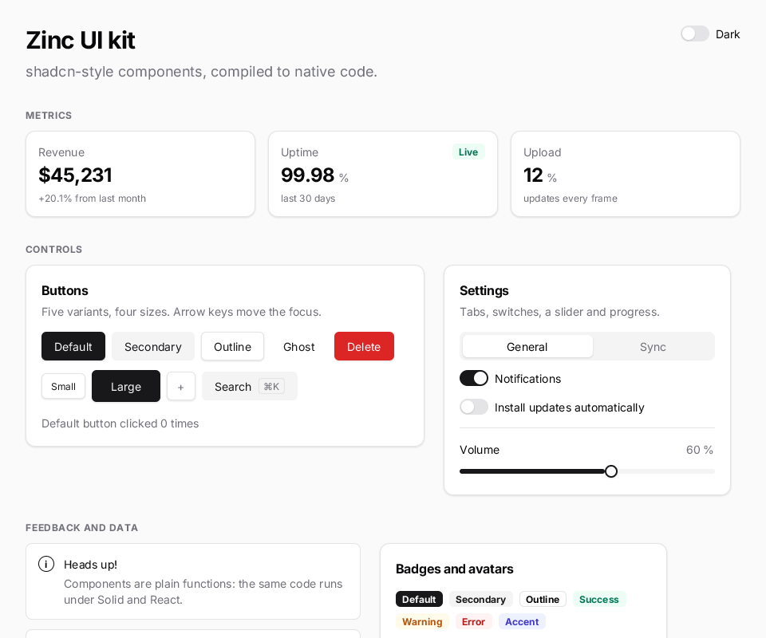
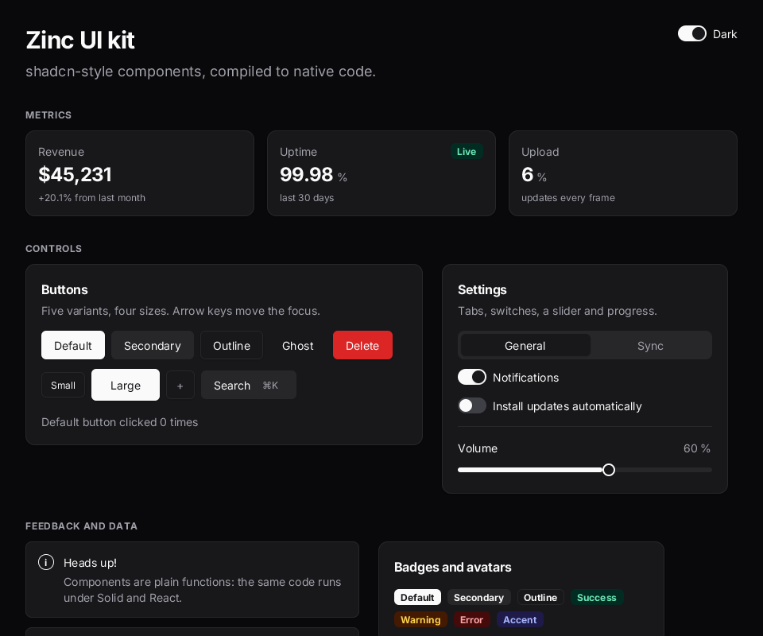

# Kit gallery

Every component of `zinc:ui/kit` (the shadcn-style kit, see [docs/ui-kit.md](../../../docs/ui-kit.md)) on one
scrolling page: metric tiles, buttons in all variants and sizes, tabs, switches, a slider, a live progress bar,
badges, avatars, alerts and a list. The **Dark** switch in the header re-themes the whole page at runtime.



## Run it

```sh
zinc run examples/ui/kit-gallery                 # macOS window (960x800)
zinc run examples/ui/kit-gallery --target wasm   # browser
zinc run examples/ui/kit-gallery --target sim    # Node oracle (headless)
zinc build examples/ui/kit-gallery --target rpi1 # Raspberry Pi (fbdev)
```

Controls: click or tap; arrow keys / Tab move the focus, Space or Enter presses; the wheel or a drag scrolls.

## What to look at

| File | Role |
| --- | --- |
| `src/main.tsx` | page layout: header with the theme switch, three labelled sections in a scroll view |
| `src/state.ts` | the signals the controls read and write, the theme toggle, the fake upload ticker |
| `src/sections/buttons.tsx` | `Button` variants and sizes, a `Kbd` inside a button, a live click counter |
| `src/sections/settings.tsx` | `Tabs` switching two panels with an inline `{cond ? <A/> : <B/>}`, `Switch`, `Slider`, `Progress` |
| `src/sections/display.tsx` | `Stat` tiles, `Badge`, `Avatar`, `Alert`, `List` / `ListItem` |

Live values are passed as accessors (`value={upload}`, `checked={notifications}`): the kit component subscribes to
the signal, so only the affected node updates when it changes.


