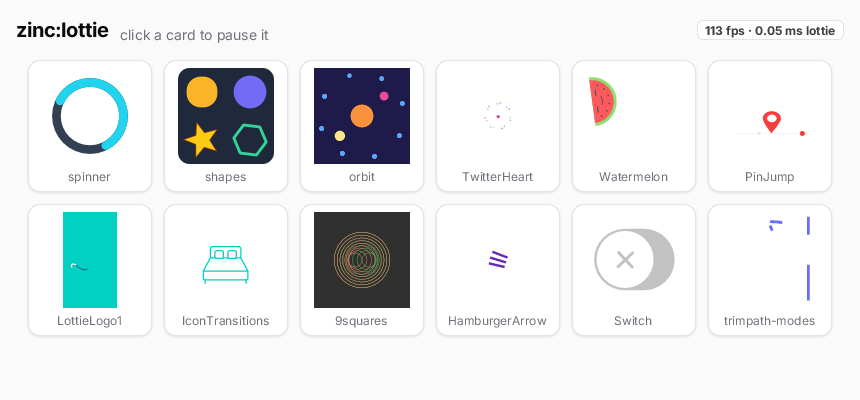

# Lottie gallery

Twelve Lottie (Bodymovin JSON) animations played natively by `zinc:lottie`
([plugin guide](../../../docs/plugins/lottie.md)) in a grid of light cards, with a readout of the frame rate and of
the time spent evaluating animations. Click a card to pause or resume it: a paused animation redraws the same
commands and the frame diff rasterizes nothing for it.



## Run it

```sh
zinc run examples/ui/lottie-gallery                   # macOS window, 860x400
zinc run examples/ui/lottie-gallery --target wasm     # browser
zinc run examples/ui/lottie-gallery --target sim      # Node (headless)
zinc build examples/ui/lottie-gallery --target rpi1   # Raspberry Pi (also linux)

LOTTIE=Watermelon.json zinc run examples/ui/lottie-gallery/src/view.ts   # one animation, full window
zinc run examples/ui/lottie-gallery/src/bench.ts      # per-frame costs of every sample (release build)
```

`view.ts` also takes `LOTTIE_FRAME=n` (a still frame) and `LOTTIE_CACHE=1` (render-to-image mode).

## What to look at

| File | Role |
| --- | --- |
| `src/main.tsx` | the page: header, readout, the grid; the half-second fps / lottie-time average |
| `src/components/AnimationCard.tsx` | a `<Lottie>` node in a clickable card; the `player` callback hands over the `Player` for pause / play |
| `src/files.ts` | the sample list (shared with the benchmark) and display names |
| `src/view.ts` | the full-window viewer |
| `src/bench.ts` | off-screen rendering of every frame: vector, raster and replay costs |

The samples in `assets/` come from lottie-ios and Skia (see [docs/licenses.md](../../../docs/licenses.md)).
