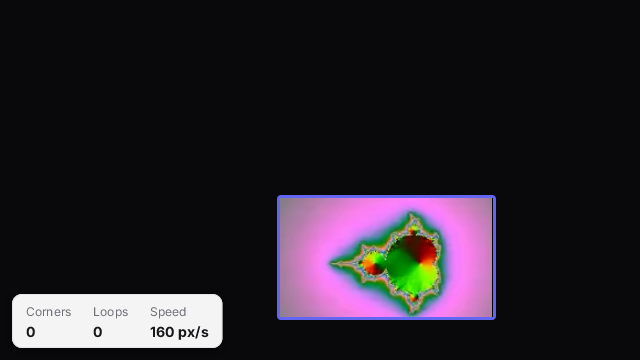

# bounce

A looping video bouncing around the screen like the DVD logo: its frame changes colour on every bounce and corner
hits are counted in a small status card. The video is decoded straight at the size it is drawn
(`new Player(w, h)`), so drawing a frame is a row copy.



## Run it

```sh
zinc run examples/video/bounce                                    # macOS window, media/fractal.mp4
zinc run examples/video/bounce -- my.mp4 --size 400 --speed 300   # your own clip, box width, speed in px/s
zinc build examples/video/bounce --target rpi1                    # Raspberry Pi, fbdev display (no X)
zinc build examples/video/bounce --target linux                   # Linux, fbdev display
```

Keys: Space pause, Up / Down speed, Esc quit.

`media/fractal.mp4` (192x108, 4 s) is generated by `../make-media.sh`.

## What to look at

| File | Role |
| --- | --- |
| `src/main.ts` | command line, the player, keys and the frame loop |
| `src/bouncer.ts` | the bounce rules: position, direction, edge reflection, corner count, frame colour |
| `src/hud.ts` | the status card: an immediate-mode version of the zinc:ui/kit card (shadow, white fill, hairline border) |
