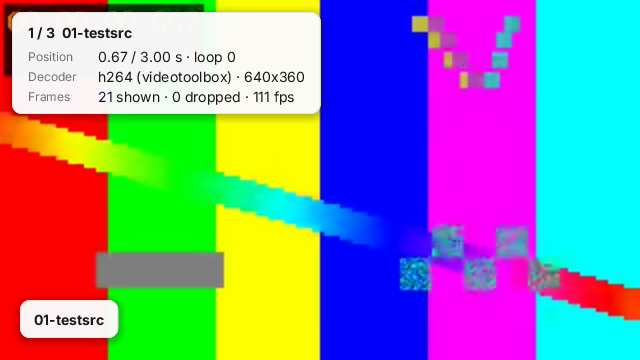

# looper

Fullscreen video looper modelled on [videolooper.de](https://videolooper.de/) (adafruit `pi_video_looper`): plays
every video of a folder, or an M3U playlist, in a **seamless** loop (the next file is pre-opened; no black frame
between files). Uses `zinc:video` and, on a Raspberry Pi, the `fbdev` display driver (no X needed). Titles, the
"Paused" state and the info overlay are light cards drawn over the video.



```sh
zinc run examples/video/looper -- examples/video/looper/media                  # macOS window
zinc run examples/video/looper -- examples/video/looper/media --is_random --info --show_titles
zinc run examples/video/looper --target sim -- examples/video/looper/media        # Node (headless)
zinc build examples/video/looper --target linux                                 # Linux, fbdev
zinc build examples/video/looper --target rpi1                                  # ARMv6 binary, fbdev + evdev
./looper /mnt/usbdrive0 --config /boot/video_looper.ini                         # on the Pi
```

## Configuration

Settings are the `video_looper.ini` keys. The file is read from `--config FILE`, else `./video_looper.ini`,
`/boot/video_looper.ini` or `/boot/firmware/video_looper.ini` (sections are ignored except `[directory] path` and
`[playlist] path`). Every key is also a flag, which wins over the file: `--key value`, `--key=value`, `--key` (true),
`--no-key` (false); a bare argument is the folder. `--help` lists them.

| key | default | |
|---|---|---|
| `path` (`[directory]`) | `media` | folder with the videos (only its root, like videolooper) |
| `playlist` (`[playlist] path`) | | M3U file, relative to the folder; `#EXTINF:0,Title` lines give titles |
| `extensions` | `mp4, mov, mkv, m4v, avi, webm, h264, mpg, ts` | |
| `is_random` / `is_random_unique` | false | random order / random without repeats until all played |
| `one_shot_playback` | false | stop after each file (Enter starts the next one) |
| `wait_time` | 0 | seconds of background between files (0 = seamless) |
| `play_on_startup` | true | false: wait for Enter |
| `resume_playlist` | false | restart at the file playing when the looper was stopped (`zinc:storage`) |
| `bgcolor` / `fgcolor` | `0, 0, 0` / `255, 255, 255` | letterbox and idle colour / text colour of the idle and countdown screens |
| `osd` / `countdown_time` | true / 5 | "Found N movies, starting in 5..." and the "Insert USB drive" screen |
| `show_titles` / `title_duration` | false / 10 | file name or M3U title at the start of each file (-1 = always) |
| `keyboard_control` | true | keys below |
| `gpio_pin_map` / `gpio_pin_mode` | / true | `"11": 1, "13": "+1", "18": "-1", "15": "video.mp4", "19": "K_SPACE"` (BOARD pins; index, relative jump, file or title, `K_SPACE`/`K_k`/`K_b`/`K_s`); true = pull-up, button to ground |
| `console_output` | false | state changes on stdout |
| `info` | false | playback info overlay (decoder, position, loops, dropped frames, fps) |

`name_repeat_3x.mp4` plays three times in a row. With no playable file the looper shows the OSD message and rescans
the folder every 2 s, so a USB stick mounted later is picked up.

## Keys

| key | videolooper | action |
|---|---|---|
| Right | `k` | skip to the next file |
| Left | `b` | back to the previous file |
| Enter | `s` | stop / start |
| Space | space | pause / resume |
| Tab | | info overlay |
| Esc | Esc | quit |

Zinc's input is a gamepad-like set of buttons (same on SDL and fbdev), hence arrows/Enter instead of `k`/`b`/`s`.

## What to look at

| File | Role |
| --- | --- |
| `src/main.ts` | playback state (countdown, start / stop, pause, wait_time), keys, GPIO actions, the frame loop |
| `src/config.ts` | settings: defaults, `video_looper.ini` parsing, CLI flags, `--help` |
| `src/playlist.ts` | the `Player` and its titles, from the folder or an M3U file (`_repeat_Nx` files) |
| `src/buttons.ts` | `gpio_pin_map`: BOARD pin numbers to BCM, pin watches |
| `src/osd.ts` | idle / countdown screens and the light overlays (title card, "Paused" pill, info card) |

## Differences from videolooper.de

Not implemented: automatic USB mounting and copy mode (point `path` at the mount point instead), the `p` power-off
key, audio (`sound`, ALSA volume files; see the zinc:video follow-ups), `bgimage`, the date/time display during
`wait_time`, omxplayer/hello_video/image_player selection (one FFmpeg player plays all formats), chapter keys.
Multiple synchronized players are not a goal there either.

## Media

`media/` holds three tiny H.264 clips (320x180 30 fps, 320x180 30 fps, 240x180 25 fps: the last one is letterboxed)
generated by `../make-media.sh` with FFmpeg's test sources.
