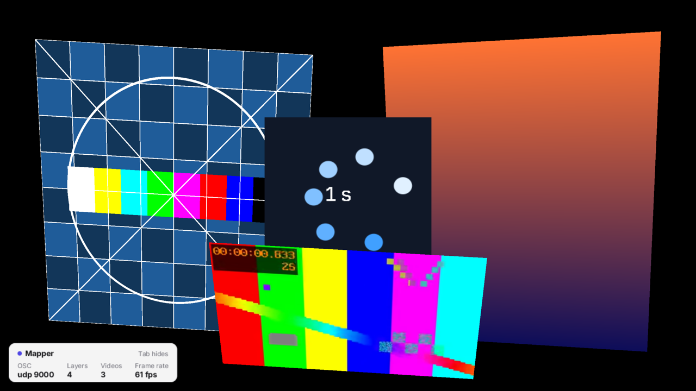

# mapper

GPU video mapping: layers of video, a test card, a gradient and a live image painted with `zinc:gfx`, each warped
onto a surface by its corner pins, composited by `zinc:mapping` on the `gl` display, and controlled over OSC. The
web companion is the editor: drag corners and mesh points, masks, edge blending, colour, save / load.
See [docs/plugins/mapping.md](../../../docs/plugins/mapping.md).



## Run it

```sh
zinc run examples/video/mapper                                       # macOS window (display gl)
zinc run examples/video/mapper -- --media examples/video/looper/media   # with videos on a layer
zinc build examples/video/mapper --target rpi1                       # Raspberry Pi 3+ (GL display)

node examples/video/mapper/companion/server.mjs --app 127.0.0.1:9000   # editor on http://localhost:8080
node examples/video/mapper/companion/demo.mjs                          # drives a running app through the editor API
```

Keys: Tab status card on / off, F fullscreen, Esc quit. The app listens for OSC on UDP 9000; the companion saves
the setup to `mapping.json` (in the working directory), which the app loads at start instead of the demo layers.
The companion listens on all interfaces without authentication: use it on a trusted network.

## What to look at

| File | Role |
| --- | --- |
| `src/main.ts` | the video player, loading or creating the setup, OSC, the frame loop |
| `src/layers.ts` | the demo layers and their corner pins |
| `src/live.ts` | a runtime image repainted every frame and used as a layer source |
| `src/hud.ts` | the status card drawn in the `zinc:gfx` overlay (black is the key colour of display-gl) |
| `companion/` | the web editor (`index.html`), its OSC relay (`server.mjs`) and a scripted check (`demo.mjs`) |
