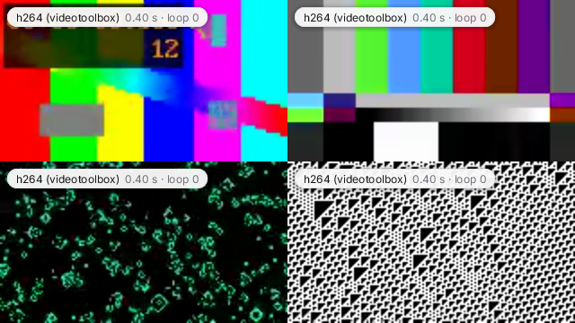

# quad

Four videos at once in a 2x2 grid: four `Player`s, four decoder threads, each clip decoded at tile size and looping
on its own. With more than four files, tile i plays files i, i+4, ... as its playlist. A small label on each tile
shows its decoder, position and loop count.



## Run it

```sh
zinc run examples/video/quad                                  # macOS window, media/*.mp4
zinc run examples/video/quad -- a.mp4 b.mp4 c.mp4 d.mp4       # four files
zinc run examples/video/quad -- /path/to/folder               # every video of a folder
zinc build examples/video/quad --target rpi1                  # Raspberry Pi, fbdev display
zinc build examples/video/quad --target linux                 # Linux, fbdev display
```

Keys: Space pause all, Right next file on every tile, Tab labels on / off, Esc quit.

On a Raspberry Pi 1 keep the clips small (four software or V4L2 decodes plus RGB conversion on one ARMv6 core);
`media/` has four 160x90 clips from `../make-media.sh`.

## What to look at

| File | Role |
| --- | --- |
| `src/main.ts` | the four players, keys and the frame loop |
| `src/media.ts` | which files to play: arguments, a folder, or the sample media |
| `src/label.ts` | the tile label: a white pill with a soft shadow, drawn with `zinc:gfx` |
