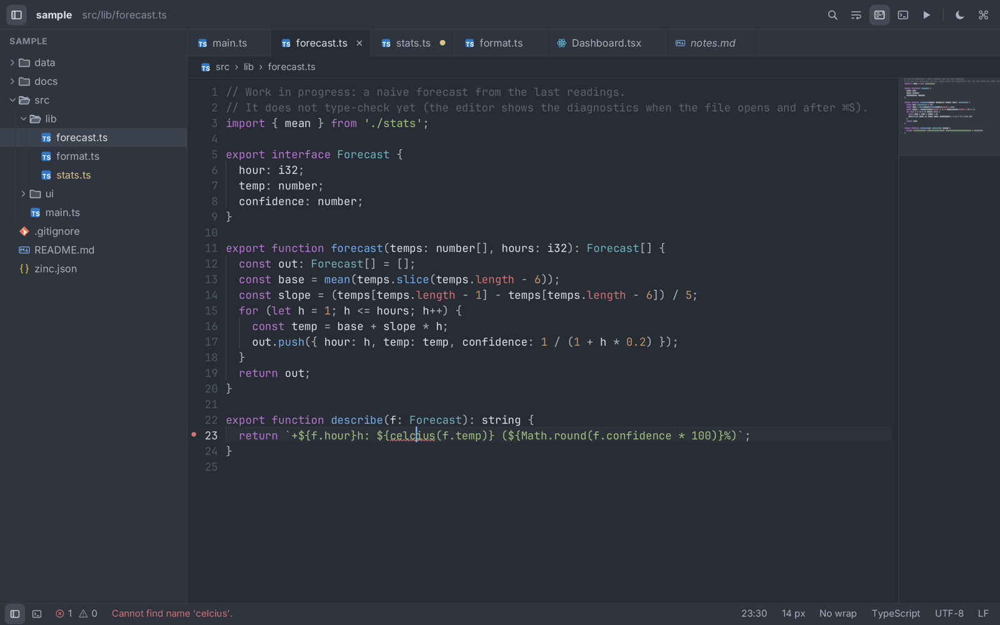
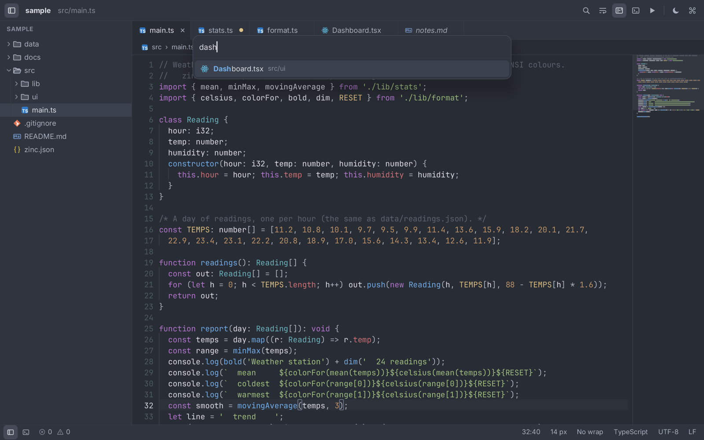
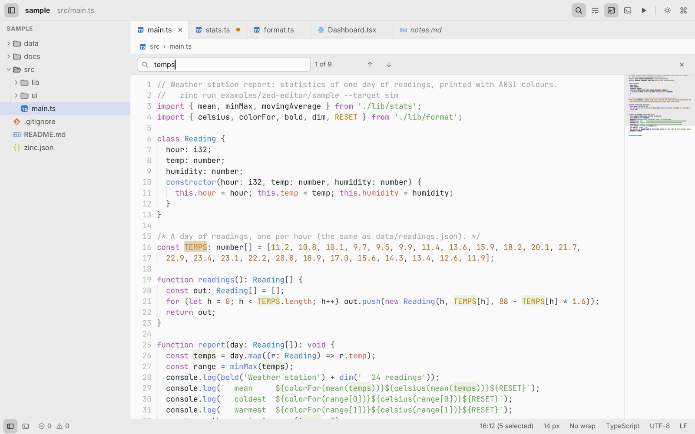

# zed-editor

A code editor in the style of [Zed](https://zed.dev), written in Zinc with `zinc:ui` (Solid model) and drawn by the
software renderer: no browser, no GPU. It opens a real folder, highlights TypeScript / TSX / JSON / Markdown / CSS,
saves with `zinc:fs`, shows `zinc check` diagnostics and runs the project in a terminal panel through `zinc:process`.



## Run it

```sh
zinc run examples/zed-editor                         # the bundled sample project (examples/zed-editor/sample)
zinc run examples/zed-editor -- path/to/folder       # any folder
ZINC_DEMO=finder zinc run examples/zed-editor        # a scripted scene (see below)
zinc run examples/zed-editor/src/selftest.ts --target sim   # checks of the matching, highlighting and parsing logic
```

Run it from the zinc checkout (or set `ZINC_ROOT`): diagnostics and the terminal panel call
`node $ZINC_ROOT/compiler/bin/zinc.mjs`. Targets: macOS and Linux (SDL3 window).

## Shortcuts

| Keys | |
| --- | --- |
| ⌘P | file finder: fuzzy search of the project's files, matched characters highlighted |
| ⌘⇧P | command palette (every action below, named like Zed's) |
| ⌘S / ⌥⌘S | save / save all (a dot marks modified tabs; closing a modified tab asks first) |
| ⌘F, Enter / ⇧Enter, ⌘G / ⌘⇧G, Esc | find in file: next / previous match, close |
| ⌘B | toggle the project panel (animated); drag its right edge to resize it |
| ⌘⇧E | focus the project panel: ↑↓ select, → expand, ← collapse / parent, Enter open, Space preview |
| ⌘J / ⌘R | toggle the terminal panel / run the project (`zinc run <project> --target sim`) |
| ⌘= ⌘- ⌘0 | buffer font size (10 to 24 px) |
| ⌥Z | soft wrap |
| ⌘W, middle click | close the tab |
| ⌃Tab, ⌘⇧] / ⌘⇧[ | next / previous tab |

Mouse: a single click in the tree opens a *preview* tab (italic title) that the next preview replaces; double-click
the file or its tab, or edit it, to keep it. Drag or click the minimap to scroll. The title bar buttons toggle the
panels, soft wrap, the minimap, the theme (One Dark / One Light) and run the project.



## What it shows

- **Project tree** read with `zinc:fs` (folders first; `.git`, `node_modules`, `build` hidden), chevrons turning on a
  spring, file icons drawn per extension, indent guides, keyboard navigation, the active file revealed.
- **Tabs**: preview semantics, modified dot that becomes the close button under the pointer, middle-click close,
  horizontal scrolling (wheel or trackpad) with the active tab kept in view.
- **Editor**: one textarea per buffer (each keeps its caret, scroll and undo history), line numbers, syntax
  highlighting with a state carried across lines (block comments, template strings, Markdown fences, CSS rules),
  current line, matching brackets, indent guides, search matches, diagnostics (squiggle, gutter dot, message in the
  status bar), soft wrap and zoom. Scrolling follows the engine's physics: trackpads 1:1 with a rubber band, eased
  mouse notches.
- **Minimap**: token-coloured blocks per line, the visible region, click or drag to scroll.
- **Palette and finder**: fuzzy matching that prefers contiguous runs, word starts and the file name; fade and scale in.
- **Status bar**: diagnostics count, line:column and selection, font size, wrap, language, encoding, line endings.
- **Terminal panel**: `zinc run` output streamed through `zinc:process`, ANSI colours rendered.



## How it is built

| File | Role |
| --- | --- |
| `src/main.tsx` | layout, app-wide shortcuts, the frame `tick` |
| `src/app/project.ts` | the folder tree (lazy loading, flattened visible rows, reveal, all files for the finder) |
| `src/app/workspace.ts` | buffers and tabs: open / preview / close / save, modified state, deferred focus |
| `src/app/document.ts` | per-buffer lines, cached tokens per line with the tokenizer state, bracket matching |
| `src/app/syntax.ts` | the tokenizers (TS / TSX / JS, JSON, Markdown, CSS) |
| `src/app/fuzzy.ts`, `search.ts` | fuzzy matching, find in file |
| `src/app/tools.ts` | `zinc check --json` diagnostics and the `zinc run` terminal (ANSI parsing) |
| `src/app/commands.ts`, `settings.ts`, `theme.ts`, `motion.ts` | palette commands, view settings, One Dark / One Light, tweens and springs |
| `src/components/` | `TitleBar`, `ProjectPanel`, `Tabs`, `Editor` (editors, decorations, minimap, find bar), `StatusBar`, `Palette`, `Terminal`, drawn `icons` |
| `src/demo.ts`, `src/selftest.ts` | scripted scenes and the scroll benchmark; logic checks |
| `sample/` | the sample project (a small weather-station program; `src/lib/forecast.ts` has a type error on purpose) |
| `assets/Inter-Italic.ttf` | Inter Italic (OFL, subset to Latin) for preview tabs |

The editor is the engine's textarea with the code editor extensions of `zinc:ui` (see [docs/ui.md](../../docs/ui.md)):
`setMarks` (current line, brackets, matches, diagnostics), `setEditColors`, `setHighlightAt` (per-line highlighter
state), `editView` / `scrollEditTo` / `editRowOf` (minimap, find), and lazy canvases (icons and the minimap are redrawn
only when the window repaints, so an idle editor costs nothing).

## Scenes and measurements

`ZINC_DEMO=<scene>` scripts the app through the input test hooks (the real mouse and keyboard are then ignored):
`editor`, `palette`, `finder`, `find`, `light`, `terminal`, `diagnostics`, `wrap`, `panel`. With `ZINC_FRAMES` and
`ZINC_SHOT` they make the screenshots:

```sh
ZINC_DEMO=diagnostics ZINC_FRAMES=150 ZINC_SHOT=shot.png zinc run examples/zed-editor
```

`ZINC_DEMO=scroll` opens a 5000-line file, scrolls it for 600 frames with a trackpad-like wheel (18 px per frame),
then 600 frames with eased mouse notches, types 100 characters in the middle, prints the numbers and quits. On an M1
Pro MacBook (2560 x 1600 Retina window, 120 Hz display, vsync on):

| | |
| --- | --- |
| trackpad scrolling | 111–117 fps (the display's 120 Hz) |
| mouse wheel, eased | 114–119 fps |
| one keystroke in a 5006-line file | 4–5 ms (edit, lines, rows, decorations; before the paint) |

## Limits

- One caret (no multi-cursor), no split panes, no go-to-definition: highlighting is lexical, per line.
- Tokens are recomputed from the first line after an edit (fast enough for thousands of lines; very large files
  would want incremental re-tokenizing).
- Closing the window does not ask about unsaved buffers.
- The terminal panel shows output only (no input, no PTY); diagnostics come from `zinc check` on the saved file.
